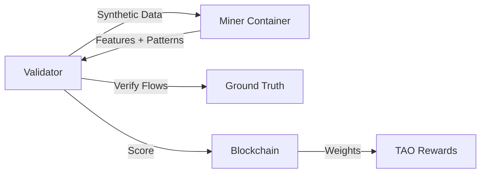

<div align="center">

# **Blockchain Analytics Subnet**

[](https://discord.gg/bittensor)
[](https://opensource.org/licenses/MIT)

**Incentivizing Advanced Blockchain Analytics Through Decentralized AI**

[Discord](https://discord.gg/bittensor) • [Bittensor Network](https://taostats.io/) • [Documentation](./docs/)

</div>

---

## Table of Contents

- [Vision](#vision)
- [How It Works](#how-it-works)
- [Tournament System](#tournament-system)
- [Scoring Model](#scoring-model)
- [Getting Started](#getting-started)
  - [For Miners](#for-miners)
  - [For Validators](#for-validators)
- [Rules & Requirements](#rules--requirements)
- [Development](#development)
- [Architecture](#architecture)
- [License](#license)

---

## Vision

The Blockchain Analytics Subnet creates a decentralized marketplace for advanced blockchain analytics algorithms by incentivizing miners to develop:

🔍 **Pattern Detection Systems** - Identify suspicious transaction patterns in blockchain data
🧠 **Feature Engineering** - Extract meaningful signals from raw blockchain transfers
💡 **Novel Discovery** - Find new patterns beyond known threat signatures
⚡ **High Performance** - Deliver fast, accurate analysis at scale

### Why This Matters

Blockchain analysis is critical for:
- **Risk Assessment** - Identify exposure to sanctioned entities, exploits, mixers
- **Compliance** - Meet regulatory requirements for crypto businesses  
- **Security** - Detect money laundering, fraud, and illicit activity
- **Intelligence** - Understand complex transaction flows and relationships

Traditional approaches rely on centralized databases and proprietary algorithms. This subnet **decentralizes blockchain intelligence** by creating an open marketplace where:
- Miners compete to build the best analytics algorithms
- Quality is measured objectively through tournament-based evaluation
- Innovation is rewarded through TAO incentives

---

## How It Works

### Participants

**🔨 Miners** develop Docker-containerized analytics code that:
1. Receives blockchain transaction data
2. Generates address-level features
3. Detects suspicious patterns (cycles, layering, proximity to flagged entities, etc.)
4. Submits results for evaluation

**⚖️ Validators** operate the tournament infrastructure that:
1. Generates synthetic blockchain datasets with known patterns
2. Runs miner containers in isolated environments
3. Scores outputs against ground truth
4. Sets weights on-chain based on performance

### Data Flow



**Inputs** (provided to miners):
- `transfers.parquet` - Blockchain transactions
- `address_labels.parquet` - Known entity labels
- `asset_prices.parquet` - Price data
- `assets.parquet` - Asset metadata

**Outputs** (produced by miners):
- `features.parquet` - Address-level analytical features
- `patterns.parquet` - Detected suspicious patterns

**Validation** (hidden from miners):
- `ground_truth.parquet` - Known injected patterns for scoring

---

## Tournament System

### Tournament Lifecycle

Analytics tournaments run on a **configurable schedule**:

**Development Mode** (10 minutes):
```
00:00 - 02:00  →  Submission Phase (miners submit code)
02:00 - 05:00  →  Epoch 0: ALL miners evaluated on torus network
05:00 - 08:00  →  Epoch 1: ALL miners evaluated on torus network  
08:00 - 11:00  →  Epoch 2: ALL miners evaluated on torus network
11:00 - 12:00  →  Finalization (rankings, weight setting)
```

**Production Mode** (6 days):
```
Day 1          →  Submission Phase (24 hours)
Day 2          →  Epoch 0: ALL miners on torus network
Day 3          →  Epoch 1: ALL miners on bittensor network
Day 4          →  Epoch 2: ALL miners on ethereum network  
Day 5          →  Epoch 3: ALL miners on ethereum network (fallback)
Day 6          →  Epoch 4: ALL miners on ethereum network (fallback)
Day 7          →  Finalization
```

### Key Concepts

**One Network Per Epoch**: Each epoch (day), ALL miners are evaluated on the SAME network. This ensures fair comparison since everyone processes identical data.

**Network Fallback**: If there are more epochs than networks configured, the last network repeats. Example: `["torus", "bittensor", "ethereum"]` with 5 epochs → torus, bittensor, ethereum, ethereum, ethereum.

**Sequential Evaluation**: Within each epoch, miners are evaluated sequentially (not in parallel) to ensure consistent resource allocation and fair timing measurements.

**Strict Disqualification**: ANY failed or timeout evaluation run disqualifies the ENTIRE submission for that tournament.

---

## Scoring Model

Miners are scored on **five components** that together measure accuracy, performance, and innovation:

| Component | Weight | What It Measures |
|-----------|--------|------------------|
| **Feature Performance** | 10% | Speed of feature generation |
| **Synthetic Recall** | 30% | % of known patterns detected |
| **Pattern Precision** | 25% | % of reported patterns that are real (anti-cheat) |
| **Novelty Discovery** | 25% | Valid new patterns beyond ground truth |
| **Pattern Performance** | 10% | Speed of pattern detection |

### Scoring Formula

```python
IF features invalid:
    score = 0.0  # Disqualified
    
ELIF no valid patterns found:
    score = 0.10 * feature_performance  # Max 10%
    
ELSE:
    score = (
        0.10 * feature_performance +
        0.30 * synthetic_recall +      # Known patterns found
        0.25 * pattern_precision +     # Anti-cheat measure
        0.25 * novelty_discovery +     # Innovation reward
        0.10 * pattern_performance
    )
```

### Anti-Cheat: Flow Verification

**ALL patterns (synthetic + novelty) are validated by tracing actual transaction flows.**

A pattern is only valid if:
1. The transaction path exists in `transfers.parquet`
2. Each hop (A→B→C→D) has corresponding transfer records
3. The pattern type is legitimate (cycle, layering, burst, etc.)

This prevents miners from:
- Reporting fake patterns
- Flooding with random guesses
- Gaming the system with false positives

**Precision Penalty**: Reporting fake patterns severely hurts your precision score (25% of total).

See [`docs/architecture/EVALUATION_SCORING_MODEL.md`](docs/architecture/EVALUATION_SCORING_MODEL.md) for complete scoring details.

---

## Getting Started

### For Miners

#### Prerequisites

- **Docker** - Your code runs in an isolated container
- **Bittensor Wallet** - Register on the subnet
- **Git** - Code repository for submissions

#### Quick Start

1. **Clone the baseline analyzer**:
   ```bash
   git clone https://github.com/chainswarm/analyzers-baseline
   cd analyzers-baseline
   ```

2. **Understand the interface**:
   ```
   Your container receives:
   ├── /data/input/
   │   ├── transfers.parquet        # Blockchain transactions
   │   ├── address_labels.parquet   # Known labels (exchanges, mixers, etc.)
   │   ├── asset_prices.parquet     # USD prices
   │   └── assets.parquet           # Asset metadata
   
   Your code must produce:
   └── /data/output/
       ├── features.parquet         # Address-level features
       └── patterns.parquet         # Detected patterns
   ```

3. **Build your Docker image**:
   ```bash
   docker build -t my-analyzer .
   ```

4. **Test locally**:
   ```bash
   docker run \
     -v $(pwd)/test_data/input:/data/input:ro \
     -v $(pwd)/test_data/output:/data/output:rw \
     my-analyzer
   ```

5. **Register on the subnet**:
   ```bash
   # Create/import your wallet
   btcli wallet create --wallet.name miner
   
   # Register on subnet (netuid TBD)
   btcli subnet register --netuid X --wallet.name miner
   ```

6. **Run your miner** to respond to tournament submission requests:
   ```bash
   python neurons/miner.py \
     --netuid X \
     --wallet.name miner \
     --wallet.hotkey default
   ```

7. **Submit to tournament**:
   When validators start a tournament, your miner will automatically receive a `SubmissionSynapse` request. Respond with:
   - `repository_url`: Your public Git repo (e.g., GitHub)
   - `commit_hash`: Specific commit to evaluate

#### Miner Best Practices

✅ **Optimize for speed** - Performance scores reward fast execution
✅ **Maximize recall** - Find as many ground truth patterns as possible  
✅ **High precision** - Only report patterns you're confident about
✅ **Discover novelty** - Find valid patterns beyond ground truth
✅ **Valid schema** - Ensure output matches expected format exactly
✅ **Deterministic** - Same input should produce same output
✅ **No network access** - Container runs with `--network none`
✅ **Resource limits** - Stay within memory (8GB) and CPU (2 cores) limits

❌ **Don't flood patterns** - High false positive rate tanks precision
❌ **Don't cache results** - Different test data each epoch
❌ **Don't hardcode** - Synthetic data changes each tournament

---

### For Validators

#### Prerequisites

- **Bittensor Wallet** - Registered validator with sufficient stake
- **Docker Compose** - Orchestration for all services
- **PostgreSQL** - Tournament result storage
- **Redis** - Task queue for Celery
- **GPU (optional)** - Faster synthetic data generation

#### Infrastructure Setup

1. **Clone the subnet repository**:
   ```bash
   git clone https://github.com/chainswarm/subnet
   cd subnet
   ```

2. **Configure environment**:
   ```bash
   cp .env.example .env
   nano .env  # Edit configuration
   ```

   **Key settings**:
   ```bash
   # Tournament Timing (Development)
   TOURNAMENT_SCHEDULE_MODE=manual        # or "daily" for production
   TOURNAMENT_SUBMISSION_DURATION_SECONDS=120
   TOURNAMENT_EPOCH_COUNT=3
   TOURNAMENT_EPOCH_DURATION_SECONDS=180
   TOURNAMENT_NETWORKS=torus

   # Tournament Timing (Production)
   # TOURNAMENT_SCHEDULE_MODE=daily
   # TOURNAMENT_SUBMISSION_DURATION_SECONDS=86400  # 24 hours
   # TOURNAMENT_EPOCH_COUNT=5
   # TOURNAMENT_EPOCH_DURATION_SECONDS=86400
   # TOURNAMENT_NETWORKS=torus,bittensor,ethereum

   # Bittensor
   WALLET_NAME=validator
   WALLET_HOTKEY=default
   NETUID=X
   SUBTENSOR_NETWORK=finney
   ```

3. **Start infrastructure** (Docker Compose):
   ```bash
   cd ops
   docker compose up -d
   ```

   This starts:
   - PostgreSQL (tournament database)
   - Redis (Celery task queue)
   - Celery Worker (evaluation execution)
   - Celery Beat (tournament scheduling)
   - Evaluation API (REST API for results)
   - Flower (Celery monitoring at `localhost:5555`)

4. **Run database migrations**:
   ```bash
   docker compose run migrations
   ```

5. **Start the validator** (outside Docker for Bittensor integration):
   ```bash
   python neurons/validator.py \
     --netuid X \
     --wallet.name validator \
     --wallet.hotkey default \
     --subtensor.network finney
   ```

#### Validator Operations

**Development Mode** - Manual tournament triggering:
```bash
# Start a tournament via API
curl -X POST "http://localhost:8000/api/v1/analytics/tournaments/start?epoch_number=1"
```

**Production Mode** - Automatic daily scheduling:
- Set `TOURNAMENT_SCHEDULE_MODE=daily` in `.env`
- Tournaments auto-start at 00:00 UTC
- Epoch numbers auto-increment

**Monitor tournaments**:
```bash
# View active tournament
curl "http://localhost:8000/api/v1/analytics/tournaments?status=in_progress"

# Check epoch evaluation progress
curl "http://localhost:8000/api/v1/analytics/tournaments/{id}/runs"

# View leaderboard
curl "http://localhost:8000/api/v1/analytics/tournaments/{id}/leaderboard"
```

**Monitor Celery tasks**:
- Flower UI: `http://localhost:5555`
- Credentials: Set via `FLOWER_USER` and `FLOWER_PASSWORD`

#### Validator Best Practices

✅ **Keep validators synced** - Ensure identical tournament timing
✅ **Monitor disk space** - Evaluation outputs stored at `/tmp/subnet/analytics/`
✅ **Regular backups** - Database contains all tournament history
✅ **Log aggregation** - Collect logs from all services for debugging
✅ **Alert on failures** - Monitor tournament completion via API
✅ **Test synthetic data** - Validate ground truth patterns before tournaments

---

## Rules & Requirements

### Submission Requirements

**Mandatory**:
- ✅ Docker image that runs without network access
- ✅ Produces `features.parquet` matching schema
- ✅ Produces `patterns.parquet` matching schema
- ✅ Completes within time limits (5 minutes feature gen, 10 minutes pattern detection)
- ✅ Stays within resource limits (8GB RAM, 2 CPU cores)
- ✅ Public Git repository (GitHub, GitLab, etc.)

**Schema Compliance**:
Both output files must match expected schemas exactly. See:
- [`docs/architecture/EVALUATION_SCORING_MODEL.md`](docs/architecture/EVALUATION_SCORING_MODEL.md#output-schema-validity)

### Disqualification Conditions

You will be **disqualified** (score = 0) if:
- ❌ Invalid output schema
- ❌ Container exits with non-zero code
- ❌ Timeout (exceeds execution limits)
- ❌ ANY evaluation run fails during tournament
- ❌ Container requires network access
- ❌ Output files missing or corrupted

### Fair Play

**Allowed**:
- ✅ Any analytics algorithm (ML, rules, heuristics, hybrid)
- ✅ Pre-trained models (no external API calls during evaluation)
- ✅ Multi-stage processing pipelines
- ✅ Knowledge of pattern types and schemas

**Prohibited**:
- ❌ Network access during evaluation
- ❌ Accessing hidden ground truth data
- ❌ Hardcoding specific test cases
- ❌ Result caching across runs
- ❌ Reporting patterns with non-existent flows
- ❌ Coordinating with other miners

---

## Development

### Local Development Setup

1. **Install dependencies**:
   ```bash
   pip install -r requirements.txt
   ```

2. **Generate synthetic test data**:
   ```bash
   python scripts/generate_synthetic_data.py \
     --network torus \
     --date 2024-01-15 \
     --window 30
   ```

3. **Test evaluation locally**:
   ```bash
   python -m evaluation.tasks.evaluation_task \
     --submission-id test-sub-id \
     --network torus \
     --test-date 2024-01-15
   ```

4. **Run API server**:
   ```bash
   python scripts/run_evaluation_api.py
   ```

### Running Tests

```bash
# Unit tests
pytest tests/

# Integration tests
pytest tests/integration/

# Scoring model tests
pytest tests/test_scoring_model.py
```

### Code Quality

```bash
# Format code
black .

# Lint
flake8 evaluation/ neurons/

# Type check
mypy evaluation/
```

---

## Architecture

### Directory Structure

```
subnet/
├── evaluation/              # Evaluation framework
│   ├── api/                # REST API (FastAPI)
│   ├── managers/           # Docker, scoring, submission management
│   ├── models/             # Database models
│   ├── repositories/       # Data access layer
│   ├── security/           # Code scanning, validation
│   └── tasks/              # Celery tasks (tournament orchestration)
├── neurons/
│   ├── miner.py           # Miner implementation
│   └── validator.py       # Validator implementation
├── template/              # Bittensor protocol definitions
├── ops/                   # Docker Compose, deployment
├── docs/                  # Documentation
│   └── architecture/      # Architecture docs
└── tests/                 # Test suite
```

### Key Components

**Tournament Orchestration** ([`evaluation/tasks/`](evaluation/tasks/)):
- `epoch_start_task.py` - Collect submissions from miners
- `epoch_orchestrator_task.py` - Manage tournament lifecycle
- `evaluation_task.py` - Run individual evaluations
- `epoch_end_task.py` - Calculate rankings, set weights

**Storage Structure**:
```
/tmp/subnet/analytics/tournaments/{tournament_id}/epochs/{epoch_number}/
  ├── input/                    # Shared test dataset
  │   └── transfers.parquet
  └── output/                   # Per-miner results
      ├── {hotkey_1}/
      │   ├── features.parquet
      │   └── patterns.parquet
      └── {hotkey_2}/
          ├── features.parquet
          └── patterns.parquet
```

### Technology Stack

- **Bittensor** - Incentive layer, subnet infrastructure
- **FastAPI** - REST API for tournament results
- **Celery** - Distributed task queue for evaluations
- **Docker** - Container isolation for miner code
- **PostgreSQL** - Tournament and results storage
- **Redis** - Celery broker and result backend
- **Pandas** - Data processing
- **Pydantic** - Schema validation

---

## Documentation

- **[Flexible Tournament Timing](docs/architecture/FLEXIBLE_TOURNAMENT_TIMING.md)** - Configuration, scheduling, timing
- **[Evaluation Scoring Model](docs/architecture/EVALUATION_SCORING_MODEL.md)** - Complete scoring details
- **[Evaluation Framework Architecture](docs/architecture/EVALUATION_FRAMEWORK_ARCHITECTURE.md)** - System design
- **[Evaluation API Documentation](docs/architecture/EVALUATION_API_DOCUMENTATION.md)** - REST API reference
- **[Running on Testnet](docs/running_on_testnet.md)** - Testnet deployment guide
- **[Running on Mainnet](docs/running_on_mainnet.md)** - Production deployment guide

---

## Support

- **Discord**: [Bittensor Discord](https://discord.gg/bittensor)
- **Issues**: [GitHub Issues](https://github.com/chainswarm/subnet/issues)
- **Documentation**: [./docs/](./docs/)

---

## License

This repository is licensed under the MIT License.

```text
# The MIT License (MIT)
# Copyright © 2024 ChainSwarm

# Permission is hereby granted, free of charge, to any person obtaining a copy of this software and associated
# documentation files (the "Software"), to deal in the Software without restriction, including without limitation
# the rights to use, copy, modify, merge, publish, distribute, sublicense, and/or sell copies of the Software,
# and to permit persons to whom the Software is furnished to do so, subject to the following conditions:

# The above copyright notice and this permission notice shall be included in all copies or substantial portions of
# the Software.

# THE SOFTWARE IS PROVIDED "AS IS", WITHOUT WARRANTY OF ANY KIND, EXPRESS OR IMPLIED, INCLUDING BUT NOT LIMITED TO
# THE WARRANTIES OF MERCHANTABILITY, FITNESS FOR A PARTICULAR PURPOSE AND NONINFRINGEMENT. IN NO EVENT SHALL
# THE AUTHORS OR COPYRIGHT HOLDERS BE LIABLE FOR ANY CLAIM, DAMAGES OR OTHER LIABILITY, WHETHER IN AN ACTION
# OF CONTRACT, TORT OR OTHERWISE, ARISING FROM, OUT OF OR IN CONNECTION WITH THE SOFTWARE OR THE USE OR OTHER
# DEALINGS IN THE SOFTWARE.
```
