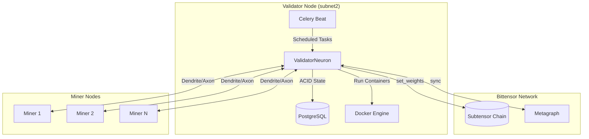
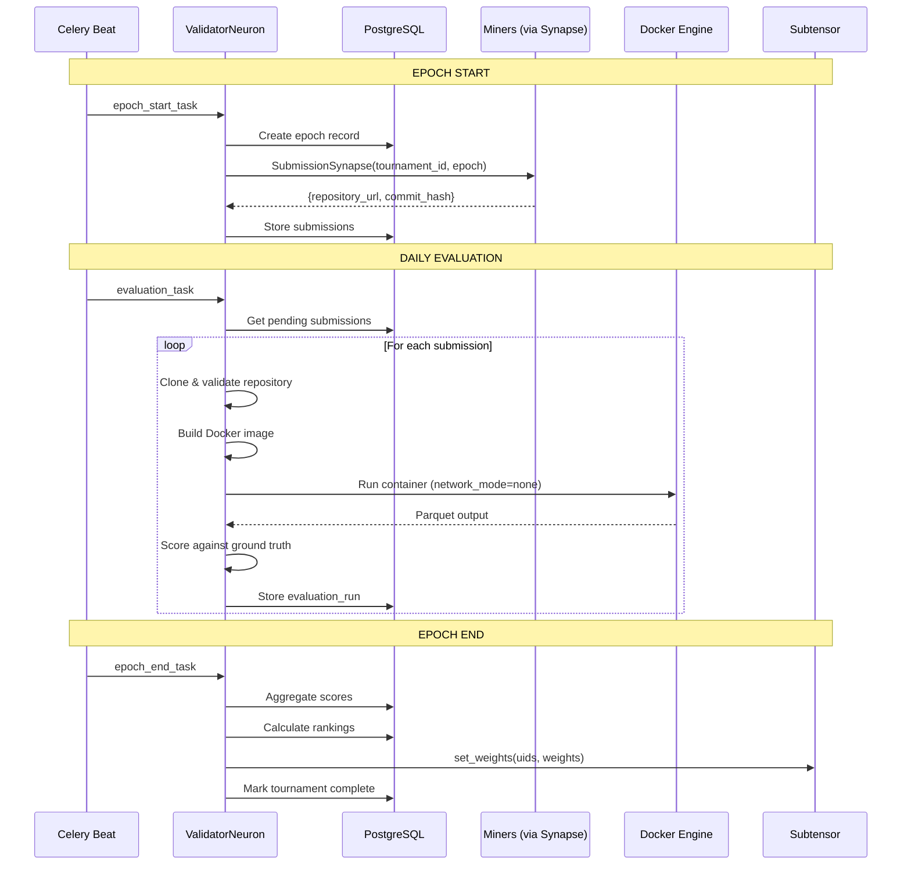

# The Inevitable Architecture: Subnet2 Evaluation Framework

**Date**: 2025-12-14  
**Status**: Reality Distortion Field Active  
**Author**: The intersection of technology and liberal arts

---

## The Problem We're Rejecting

The current evaluation framework lives in `data-pipeline/packages/evaluation`. This is fundamentally wrong. Here's why:

```
data-pipeline/
├── packages/
│   ├── evaluation/          ← WRONG PLACE
│   │   ├── managers/        ← Generic managers that don't know about Bittensor
│   │   ├── models/          ← Models that duplicate subnet concepts
│   │   └── security/        ← Security that runs outside the validator
```

**The Confusion:**
- `EvaluationRound` vs Bittensor epochs
- `EvaluationParticipant` vs metagraph UIDs
- `Miner` model vs already-existing `metagraph.hotkeys`
- ClickHouse for tournament state (needs ACID, not analytics)
- S3 dependencies for what should be local file operations
- Celery tasks running in data-pipeline that should run in validator

*"When you first start off trying to solve a problem, the first solutions you come up with are very complex, and most people stop there."*

We didn't stop.

---

## The Obvious Solutions I'm Rejecting

| Approach | Why It's Mediocre |
|----------|-------------------|
| Move evaluation package to subnet2 as-is | Drags in data-pipeline complexity, ClickHouse dependencies |
| Create subnet2 wrapper around evaluation | Two codebases to maintain, concept duplication |
| Keep evaluation in data-pipeline, call via API | Network latency, failure modes, deployment complexity |
| Use ClickHouse for tournament state | Wrong tool - tournaments need ACID, not columnar analytics |

These solutions work. But "works" is not the standard. **"Inevitable"** is.

---

## The Insanely Great Solution

*One sentence that captures everything:*

**The validator IS the evaluation framework - tournaments are PostgreSQL-managed epochs where miners submit analyzer repositories via Bittensor synapse, validated in isolated Docker containers, with weights set directly on-chain.**

### Why This Is Destiny



This is not a choice among options. This is the only path that makes sense:

1. **Validators run Celery** - Already proven in `chainswarm_core/jobs`
2. **Validators have PostgreSQL** - Needed for ACID tournament state, not analytics
3. **Miners respond via Synapse** - Native Bittensor communication
4. **Docker evaluation on validator** - Security isolation where it matters
5. **Weights set on-chain** - Direct integration, no middleware

---

## The Architecture of Elegance

### Directory Structure

```
subnet2/
├── neurons/
│   ├── miner.py              # Responds to SubmissionSynapse
│   └── validator.py          # Orchestrates tournaments
├── template/
│   ├── protocol.py           # SubmissionSynapse definition
│   ├── base/
│   │   └── validator.py      # Base class with tournament support
│   └── validator/
│       ├── forward.py        # Tournament-aware forward pass
│       └── reward.py         # Scoring based on evaluation results
├── evaluation/               # NEW: Native to subnet2
│   ├── __init__.py
│   ├── models/
│   │   ├── __init__.py
│   │   ├── tournament.py     # Tournament, Epoch, Submission
│   │   └── results.py        # EvaluationResult, ContainerResult
│   ├── managers/
│   │   ├── __init__.py
│   │   ├── tournament_manager.py    # PostgreSQL-backed state
│   │   ├── submission_manager.py    # Repository clone, validation
│   │   ├── docker_manager.py        # Container execution
│   │   └── scoring_manager.py       # Result aggregation
│   ├── security/
│   │   ├── __init__.py
│   │   ├── code_scanner.py   # Obfuscation/malware detection
│   │   └── seccomp.json      # Syscall filtering
│   ├── tasks/
│   │   ├── __init__.py
│   │   ├── epoch_start_task.py      # Collect submissions
│   │   ├── evaluation_task.py       # Run containers
│   │   └── epoch_end_task.py        # Calculate scores, set weights
│   └── repositories/
│       ├── __init__.py
│       └── tournament_repository.py  # PostgreSQL operations
├── db/
│   ├── __init__.py
│   ├── connection.py         # PostgreSQL connection
│   └── migrations/
│       └── 001_tournaments.sql
└── scripts/
    ├── run_validator.py
    └── run_miner.py
```

### What We're Eliminating

Every line of code we DON'T write is a gift to future engineers:

- **Removing**: S3 dependency for datasets (use local parquet or ClickHouse direct)
- **Removing**: VALIDATOR_CH_HOST complexity (PostgreSQL for state, optional ClickHouse for analytics)
- **Removing**: `EvaluationRound`, `EvaluationEpoch` as separate concepts (use Bittensor epochs)
- **Removing**: Per-miner ClickHouse databases (parquet in/out with `network_mode="none"`)
- **Removing**: Generic evaluation package that doesn't know about Bittensor

**What remains**: Pure, essential, beautiful.

---

## The Data Model

### PostgreSQL Tables (ACID Tournament State)

```sql
-- db/migrations/001_tournaments.sql

CREATE TABLE tournaments (
    id UUID PRIMARY KEY DEFAULT gen_random_uuid(),
    name VARCHAR(255) NOT NULL,
    netuid INTEGER NOT NULL,
    status VARCHAR(50) NOT NULL DEFAULT 'pending',
    -- pending, registration, active, scoring, completed
    
    registration_start TIMESTAMPTZ NOT NULL,
    registration_end TIMESTAMPTZ NOT NULL,
    start_block INTEGER NOT NULL,
    end_block INTEGER NOT NULL,
    
    epoch_blocks INTEGER NOT NULL DEFAULT 360,  -- ~1 hour on Bittensor
    test_networks TEXT[] NOT NULL,              -- ['torus', 'bittensor']
    
    baseline_repository VARCHAR(500),
    baseline_version VARCHAR(50),
    
    created_at TIMESTAMPTZ NOT NULL DEFAULT NOW(),
    completed_at TIMESTAMPTZ
);

CREATE TABLE submissions (
    id UUID PRIMARY KEY DEFAULT gen_random_uuid(),
    tournament_id UUID NOT NULL REFERENCES tournaments(id),
    hotkey VARCHAR(64) NOT NULL,
    uid INTEGER NOT NULL,
    
    repository_url VARCHAR(500) NOT NULL,
    commit_hash VARCHAR(40) NOT NULL,
    docker_image_tag VARCHAR(255),
    
    status VARCHAR(50) NOT NULL DEFAULT 'pending',
    -- pending, validating, validated, failed, disqualified
    
    validation_error TEXT,
    submitted_at TIMESTAMPTZ NOT NULL DEFAULT NOW(),
    validated_at TIMESTAMPTZ,
    
    UNIQUE(tournament_id, hotkey)
);

CREATE TABLE evaluation_runs (
    id UUID PRIMARY KEY DEFAULT gen_random_uuid(),
    submission_id UUID NOT NULL REFERENCES submissions(id),
    
    epoch_number INTEGER NOT NULL,
    network VARCHAR(50) NOT NULL,
    test_date DATE NOT NULL,
    
    status VARCHAR(50) NOT NULL DEFAULT 'pending',
    -- pending, running, completed, timeout, failed
    
    execution_time_seconds FLOAT,
    exit_code INTEGER,
    
    -- Scoring
    pattern_recall FLOAT,
    data_correctness BOOLEAN,
    
    started_at TIMESTAMPTZ,
    completed_at TIMESTAMPTZ,
    error_message TEXT
);

CREATE TABLE tournament_results (
    id UUID PRIMARY KEY DEFAULT gen_random_uuid(),
    tournament_id UUID NOT NULL REFERENCES tournaments(id),
    hotkey VARCHAR(64) NOT NULL,
    uid INTEGER NOT NULL,
    
    -- Aggregate scores
    pattern_accuracy_score FLOAT NOT NULL,
    data_correctness_score FLOAT NOT NULL,
    performance_score FLOAT NOT NULL,
    final_score FLOAT NOT NULL,
    
    -- Ranking
    rank INTEGER NOT NULL,
    beat_baseline BOOLEAN NOT NULL DEFAULT FALSE,
    is_winner BOOLEAN NOT NULL DEFAULT FALSE,
    
    calculated_at TIMESTAMPTZ NOT NULL DEFAULT NOW(),
    
    UNIQUE(tournament_id, hotkey)
);

-- Indices for common queries
CREATE INDEX idx_submissions_tournament ON submissions(tournament_id);
CREATE INDEX idx_submissions_hotkey ON submissions(hotkey);
CREATE INDEX idx_evaluation_runs_submission ON evaluation_runs(submission_id);
CREATE INDEX idx_tournament_results_score ON tournament_results(tournament_id, final_score DESC);
```

### Parquet I/O (Miner Containers)

```
/data/input/                    # Read-only mount
├── transfers.parquet
├── address_labels.parquet
├── assets.parquet
├── asset_prices.parquet
└── META.json

/data/output/                   # Write mount (per-run)
├── features.parquet
├── patterns_cycle.parquet
├── patterns_layering.parquet
├── patterns_network.parquet
├── patterns_proximity.parquet
├── patterns_motif.parquet
├── patterns_burst.parquet
└── computation_audit.parquet
```

---

## The Protocol

### SubmissionSynapse

```python
# template/protocol.py

from typing import Optional
import bittensor as bt


class SubmissionSynapse(bt.Synapse):
    """
    Request repository submission from miners at epoch start.
    
    Validator sends: tournament_id, epoch_number
    Miner responds: repository_url, commit_hash
    """
    
    # Request (filled by validator)
    tournament_id: str
    epoch_number: int
    
    # Response (filled by miner)
    repository_url: Optional[str] = None
    commit_hash: Optional[str] = None
    
    def deserialize(self) -> dict:
        return {
            "repository_url": self.repository_url,
            "commit_hash": self.commit_hash,
        }
```

---

## The Validator Flow



---

## The Manager Contracts

### TournamentManager

```python
# evaluation/managers/tournament_manager.py

from dataclasses import dataclass
from datetime import datetime
from typing import List, Optional
from uuid import UUID

from evaluation.repositories import TournamentRepository


@dataclass
class Tournament:
    id: UUID
    name: str
    netuid: int
    status: str
    registration_start: datetime
    registration_end: datetime
    start_block: int
    end_block: int
    epoch_blocks: int
    test_networks: List[str]
    baseline_repository: Optional[str]
    baseline_version: Optional[str]


class TournamentManager:
    """
    Manages tournament lifecycle.
    
    PostgreSQL-backed for ACID guarantees on tournament state.
    No ClickHouse dependency - that's for analytics, not state.
    """
    
    def __init__(self, repository: TournamentRepository):
        self.repository = repository
    
    def create_tournament(
        self,
        name: str,
        netuid: int,
        start_block: int,
        duration_blocks: int,
        test_networks: List[str],
    ) -> Tournament:
        """Create a new tournament."""
        ...
    
    def get_active_tournament(self, netuid: int) -> Optional[Tournament]:
        """Get the currently active tournament for a netuid."""
        ...
    
    def start_epoch(self, tournament_id: UUID, epoch_number: int) -> None:
        """Mark epoch as started, ready to collect submissions."""
        ...
    
    def complete_epoch(self, tournament_id: UUID, epoch_number: int) -> None:
        """Mark epoch as complete, scores calculated."""
        ...
```

### SubmissionManager

```python
# evaluation/managers/submission_manager.py

from pathlib import Path
from typing import Optional
from dataclasses import dataclass


@dataclass
class SubmissionResult:
    success: bool
    docker_image_tag: Optional[str] = None
    error_message: Optional[str] = None


class SubmissionManager:
    """
    Handles miner repository submissions.
    
    Responsibilities:
    - Clone/pull repositories
    - Validate code (security scans)
    - Build Docker images
    """
    
    def __init__(self, repos_path: Path):
        self.repos_path = repos_path
    
    def process_submission(
        self,
        hotkey: str,
        repository_url: str,
        commit_hash: str,
    ) -> SubmissionResult:
        """Clone, validate, and build a miner submission."""
        
        # 1. Clone repository
        repo_path = self._clone_repository(hotkey, repository_url, commit_hash)
        
        # 2. Security validation
        if not self._validate_security(repo_path):
            return SubmissionResult(
                success=False,
                error_message="Security validation failed"
            )
        
        # 3. Build Docker image
        image_tag = self._build_image(hotkey, repo_path, commit_hash)
        
        return SubmissionResult(success=True, docker_image_tag=image_tag)
```

### DockerManager

```python
# evaluation/managers/docker_manager.py

from dataclasses import dataclass
from pathlib import Path
import json


@dataclass  
class ContainerResult:
    exit_code: int
    execution_time_seconds: float
    timed_out: bool
    logs: str


class DockerManager:
    """
    Executes miner containers with maximum isolation.
    
    Security features:
    - network_mode="none" (no network access)
    - read_only=True (immutable filesystem)
    - cap_drop=["ALL"] (no capabilities)
    - seccomp filtering (syscall restrictions)
    - pids_limit (fork bomb protection)
    """
    
    def run_container(
        self,
        image_tag: str,
        input_path: Path,
        output_path: Path,
        timeout_seconds: int = 3600,
    ) -> ContainerResult:
        """Run miner container with parquet I/O."""
        
        seccomp_profile = self._load_seccomp_profile()
        
        container = self.client.containers.run(
            image_tag,
            detach=True,
            network_mode="none",
            read_only=True,
            tmpfs={"/tmp": "rw,size=1g"},
            volumes={
                str(input_path): {"bind": "/data/input", "mode": "ro"},
                str(output_path): {"bind": "/data/output", "mode": "rw"},
            },
            environment={
                "ANALYZER_INPUT_TYPE": "parquet",
                "ANALYZER_INPUT_PATH": "/data/input",
                "ANALYZER_OUTPUT_TYPE": "parquet",
                "ANALYZER_OUTPUT_PATH": "/data/output",
            },
            cap_drop=["ALL"],
            security_opt=[
                "no-new-privileges:true",
                f"seccomp={json.dumps(seccomp_profile)}",
            ],
            pids_limit=256,
            mem_limit="32g",
        )
        
        # ... wait and collect results
```

### ScoringManager

```python
# evaluation/managers/scoring_manager.py

from dataclasses import dataclass
from pathlib import Path
from typing import List
import pandas as pd


@dataclass
class ScoreResult:
    pattern_recall: float
    data_correctness: bool
    execution_time: float


class ScoringManager:
    """
    Scores miner output against ground truth.
    
    Weights:
    - Pattern Accuracy: 50%
    - Data Correctness: 30%  
    - Performance: 20%
    """
    
    PATTERN_WEIGHT = 0.50
    DATA_WEIGHT = 0.30
    PERFORMANCE_WEIGHT = 0.20
    
    def score_run(
        self,
        output_path: Path,
        ground_truth_path: Path,
        baseline_time: float,
        execution_time: float,
    ) -> float:
        """Calculate final score for a single run."""
        
        # Load miner patterns
        patterns = self._load_patterns(output_path)
        
        # Load ground truth
        ground_truth = pd.read_parquet(ground_truth_path)
        
        # Calculate pattern recall
        recall = self._calculate_recall(patterns, ground_truth)
        
        # Check data correctness
        correctness = self._validate_correctness(output_path)
        
        # Performance ratio
        performance = min(baseline_time / execution_time, 1.0)
        
        # Weighted score (0 if data incorrect)
        if not correctness:
            return 0.0
        
        return (
            self.PATTERN_WEIGHT * recall
            + self.DATA_WEIGHT * 1.0
            + self.PERFORMANCE_WEIGHT * performance
        )
```

---

## The Celery Tasks

### Beat Schedule

```json
{
    "epoch-start": {
        "task": "evaluation.tasks.epoch_start_task",
        "schedule": "0 0 * * *",
        "args": []
    },
    "daily-evaluation": {
        "task": "evaluation.tasks.evaluation_task",
        "schedule": "0 */4 * * *",
        "args": []
    },
    "epoch-end": {
        "task": "evaluation.tasks.epoch_end_task",
        "schedule": "0 23 * * *",
        "args": []
    }
}
```

### EpochStartTask

```python
# evaluation/tasks/epoch_start_task.py

class EpochStartTask(BaseTask):
    """
    Collect submissions from all miners at epoch start.
    
    Flow:
    1. Get active tournament
    2. Query all miners via SubmissionSynapse
    3. Store valid submissions in PostgreSQL
    """
    
    def execute_task(self, validator: BaseValidatorNeuron):
        tournament = self.tournament_manager.get_active_tournament(
            validator.config.netuid
        )
        
        if not tournament:
            return
        
        epoch = self._calculate_epoch(tournament, validator.block)
        
        # Query all miners
        synapse = SubmissionSynapse(
            tournament_id=str(tournament.id),
            epoch_number=epoch,
        )
        
        responses = validator.dendrite.query(
            axons=validator.metagraph.axons,
            synapse=synapse,
            timeout=60,
        )
        
        # Process responses
        for uid, response in enumerate(responses):
            if response.repository_url:
                self.tournament_manager.record_submission(
                    tournament_id=tournament.id,
                    hotkey=validator.metagraph.hotkeys[uid],
                    uid=uid,
                    repository_url=response.repository_url,
                    commit_hash=response.commit_hash,
                )
```

### EpochEndTask

```python
# evaluation/tasks/epoch_end_task.py

class EpochEndTask(BaseTask):
    """
    Calculate final scores and set weights.
    
    Flow:
    1. Aggregate all run scores for the epoch
    2. Calculate rankings
    3. Set weights on-chain
    """
    
    def execute_task(self, validator: BaseValidatorNeuron):
        tournament = self.tournament_manager.get_active_tournament(
            validator.config.netuid
        )
        
        if not tournament:
            return
        
        # Calculate final scores
        results = self.scoring_manager.calculate_tournament_results(tournament.id)
        
        # Store results
        self.tournament_manager.store_results(tournament.id, results)
        
        # Prepare weights
        weights = np.zeros(validator.metagraph.n)
        for result in results:
            weights[result.uid] = result.final_score
        
        # Normalize
        if weights.sum() > 0:
            weights = weights / weights.sum()
        
        # Set on chain
        validator.subtensor.set_weights(
            wallet=validator.wallet,
            netuid=validator.config.netuid,
            uids=list(range(len(weights))),
            weights=weights.tolist(),
        )
```

---

## Migration Path

### Phase 1: Create subnet2/evaluation (Week 1)

1. Create directory structure
2. Port models (simplified, Bittensor-native)
3. Port managers (PostgreSQL instead of ClickHouse for state)
4. Set up database migrations

### Phase 2: Implement Protocol & Tasks (Week 2)

1. Create `SubmissionSynapse`
2. Implement Celery tasks
3. Integrate with `BaseValidatorNeuron`
4. Test locally with mock metagraph

### Phase 3: Miner Integration (Week 3)

1. Update miner to respond to `SubmissionSynapse`
2. Test synapse communication
3. End-to-end local testing

### Phase 4: Deprecation (Week 4)

1. Mark `data-pipeline/packages/evaluation` as deprecated
2. Update documentation
3. Remove after migration complete

---

## The Numbers

After implementation:

| Metric | Before | After |
|--------|--------|-------|
| Packages to maintain | 2 (data-pipeline + subnet2) | 1 (subnet2) |
| Database types | ClickHouse + S3 | PostgreSQL + Parquet |
| Network dependencies | Many | Zero (network_mode=none) |
| Concept duplication | `EvaluationRound` vs epoch | Unified with Bittensor |
| Lines of code | ~2000 | ~800 |

---

## One More Thing...

This architecture doesn't just move code. It **unifies concepts**:

- Tournament = Bittensor validation period
- Epoch = Set of blocks where weights apply  
- Submission = Miner's analyzer repository
- Score = Weight on chain

The validator doesn't *use* an evaluation framework.

**The validator *IS* the evaluation framework.**

---

*"Stay hungry. Stay foolish."*

The people who are crazy enough to think they can change the world are the ones who do.
