# Analytics Tournament Scoring Model

## Overview

This document describes the scoring model for **Analytics Tournaments** in the Subnet's multi-tournament evaluation system. The Subnet supports multiple tournament types:

| Tournament Type | Prefix | Description |
|----------------|--------|-------------|
| **Analytics** | `analytics_` | Pattern detection & feature generation on synthetic blockchain data |
| **ML** | `ml_` | Machine learning model evaluation (future) |
| **LLM** | `llm_` | Language model evaluation (future) |

This document focuses specifically on the **Analytics Tournament** scoring model, which is designed to be fair, anti-cheat resistant, and measure both accuracy and performance.

---

## API Endpoint Structure

Analytics tournaments use the `/analytics/` segment prefix:

```
/api/v1/analytics/tournaments                    # List analytics tournaments
/api/v1/analytics/tournaments/{id}               # Get tournament details
/api/v1/analytics/tournaments/{id}/leaderboard   # Tournament leaderboard
/api/v1/analytics/tournaments/{id}/results       # Individual results
/api/v1/analytics/stats/miners/{hotkey}          # Miner analytics stats
/api/v1/analytics/stats/epochs/{epoch}           # Epoch analytics stats
```

Future tournament types will use their own segments:
```
/api/v1/ml/tournaments/...                       # ML tournaments
/api/v1/llm/tournaments/...                      # LLM tournaments
```

---

## Data Flow

```mermaid
flowchart LR
    subgraph Input["📥 Test Input (Validator Controls)"]
        T[transfers.parquet]
        AL[address_labels.parquet]
        AP[asset_prices.parquet]
        A[assets.parquet]
        GT[ground_truth.parquet<br/>HIDDEN from miner]
    end
    
    subgraph Container["⚙️ Miner Container<br/>(network_mode=none)"]
        FG[Feature Generation]
        PD[Pattern Detection]
    end
    
    subgraph Output["📤 Miner Output"]
        FP[features.parquet]
        PP[patterns.parquet]
    end
    
    subgraph Scoring["✅ Scoring (Validator)"]
        V1[Validate features schema]
        V2[Compare patterns vs ground_truth]
        V3[Measure execution times]
    end
    
    T --> Container
    AL --> Container
    AP --> Container
    A --> Container
    
    Container --> FP
    Container --> PP
    
    FP --> V1
    PP --> V2
    GT --> V2
    Container --> V3
    
    V1 --> FinalScore
    V2 --> FinalScore
    V3 --> FinalScore
```



### Directory Structure

```
data/
├── synthetics/                         # INPUT (given to miners)
│   └── snapshots/{network}/{date}/{window}/
│       ├── transfers.parquet           # Transaction data
│       ├── address_labels.parquet      # Known address labels
│       ├── assets.parquet              # Asset metadata
│       ├── asset_prices.parquet        # USD prices
│       ├── ground_truth.parquet        # HIDDEN - expected patterns
│       └── META.json                   # Batch metadata
│
└── analyzers/                          # OUTPUT (miner produces)
    └── snapshots/{network}/{date}/{window}/
        ├── features.parquet            # Generated features
        ├── patterns.parquet            # Detected patterns
        └── META.json                   # Output metadata
```

---

## Scoring Components

### Three Evaluation Pillars

Analytics tournaments evaluate miners on three distinct components:

```mermaid
flowchart TB
    subgraph Pillars["📊 Three Evaluation Pillars"]
        F["🔢 Features<br/>Address-level ML features"]
        S["🔍 Synthetic Patterns<br/>Known patterns from ground_truth"]
        N["💡 Novelty Patterns<br/>New discoveries by miner"]
    end
    
    F --> Valid["Gate: Schema Valid?"]
    S --> Recall["How many found?"]
    N --> Verify["Verified in transfers?"]
    
    Valid --> FScore["Feature Score"]
    Recall --> SScore["Synthetic Score"]
    Verify --> NScore["Novelty Score"]
    
    FScore --> Final["Final Score"]
    SScore --> Final
    NScore --> Final
```



### Summary Table

| Component | Weight | Type | Description |
|-----------|--------|------|-------------|
| **Feature Validity** | Gate | Binary | Features must match expected schema |
| **Feature Generation Performance** | 10% | Score 0-1 | Speed of feature generation |
| **Synthetic Pattern Recall** | 30% | Score 0-1 | % of ground_truth patterns found |
| **Pattern Precision** | 25% | Score 0-1 | % of ALL reported patterns that are real (anti-cheat) |
| **Novelty Pattern Discovery** | 25% | Score 0-1 | Valid novel patterns beyond ground_truth |
| **Pattern Detection Performance** | 10% | Score 0-1 | Speed of pattern detection |

### Scoring Formula

```
IF feature_validity == FALSE:
    final_score = 0.0  # Disqualified - must produce valid features
    
ELIF (synthetic_patterns_valid == 0 AND novelty_patterns_valid == 0):
    final_score = 0.10 * feature_performance  # Only 10% possible - no valid patterns
    
ELSE:
    final_score = (
        0.10 * feature_performance +
        0.30 * synthetic_recall +         # Known patterns found
        0.25 * pattern_precision +        # Anti-cheat (ALL patterns)
        0.25 * novelty_discovery_score +  # New valid patterns
        0.10 * pattern_performance
    )
```

---

## Pattern Validation: Flow Tracing

### Core Concept

**ALL patterns (synthetic AND novelty) are validated by tracing actual flows in `transfers.parquet`.**

A pattern is valid if and only if the transaction flows it describes actually exist in the transfer data.

```mermaid
flowchart LR
    MP[Miner Pattern<br/>A→B→C→D cycle] --> FT[Flow Tracer]
    T[transfers.parquet] --> FT
    FT --> Decision{Flows exist?}
    Decision -->|Yes| Valid["✅ Valid Pattern"]
    Decision -->|No| Invalid["❌ Fake Pattern"]
```



### Flow Verification Logic

```python
def verify_pattern_flows(
    pattern: PatternRecord,
    transfers: pd.DataFrame
) -> bool:
    """
    Verify that a pattern's transaction flows exist in transfers.parquet.
    
    Args:
        pattern: Contains address_path, transaction flow details
        transfers: All transactions in the test window
        
    Returns:
        True if all required flows exist, False otherwise
    """
    # Extract pattern's claimed flows
    address_path = pattern.address_path  # e.g., ["A", "B", "C", "D"]
    
    # Verify each hop in the path exists as a real transfer
    for i in range(len(address_path) - 1):
        from_addr = address_path[i]
        to_addr = address_path[i + 1]
        
        # Check if this transfer exists
        flow_exists = transfers[
            (transfers['from_address'] == from_addr) &
            (transfers['to_address'] == to_addr)
        ].shape[0] > 0
        
        if not flow_exists:
            return False  # Pattern claims a non-existent flow
    
    return True


def validate_all_patterns(
    miner_patterns: pd.DataFrame,
    transfers: pd.DataFrame,
    ground_truth: pd.DataFrame
) -> PatternValidationResult:
    """
    Validate all miner-reported patterns using flow tracing.
    
    Returns:
        PatternValidationResult with counts for:
        - synthetic_found: Known GT patterns correctly detected
        - synthetic_expected: Total patterns in ground_truth
        - novelty_valid: New patterns verified in transfers
        - novelty_invalid: Claimed patterns not in transfers (fake)
        - total_reported: All patterns miner reported
    """
    gt_pattern_ids = set(ground_truth['pattern_instance_id'].unique())
    
    synthetic_found = 0
    novelty_valid = 0
    novelty_invalid = 0
    
    for _, pattern in miner_patterns.iterrows():
        # First: verify the pattern flows exist in transfers
        flows_exist = verify_pattern_flows(pattern, transfers)
        
        if not flows_exist:
            novelty_invalid += 1  # Fake pattern - flows don't exist
            continue
        
        # Flows verified - now classify
        if pattern['pattern_id'] in gt_pattern_ids:
            synthetic_found += 1  # Known pattern correctly detected
        else:
            novelty_valid += 1  # Genuine novel discovery!
    
    return PatternValidationResult(
        synthetic_found=synthetic_found,
        synthetic_expected=len(gt_pattern_ids),
        novelty_valid=novelty_valid,
        novelty_invalid=novelty_invalid,
        total_reported=len(miner_patterns)
    )
```

---

## Gate 1: Output Schema Validity

### Purpose
Ensure miners produce valid **output** that conforms to the expected schema.

> **Note**: We control the input data (`transfers.parquet`, `address_labels.parquet`, etc.) so no input validation is needed. Only output is validated.

### Output Files Validated

| File | Validation |
|------|------------|
| `features.parquet` | Schema compliance + non-empty |
| `patterns.parquet` | Schema compliance + valid pattern types |

### Feature Output Validation

1. **Required Columns**: All columns from `analyzers_features` schema must exist
2. **Data Types**: Each column must have the correct type
3. **Non-Empty**: Must contain at least one row
4. **Primary Key**: `address` column cannot have null values

### Pattern Output Validation

1. **Required Columns**: `pattern_id`, `pattern_type`, `addresses`, etc.
2. **Valid Pattern Types**: Must be one of: `cycle`, `layering_path`, `smurfing_network`, `proximity_risk`, `motif_fanin`, `motif_fanout`, `temporal_burst`, `threshold_evasion`
3. **Address References**: Referenced addresses must exist in `features.parquet`

### Result
- **PASS**: Proceed to scoring
- **FAIL**: `final_score = 0.0`, disqualified

---

## Gate 2: Pattern Existence

### Purpose
Ensure miners detect at least some REAL patterns (prevents empty or fake submissions).

Both synthetic AND novelty patterns count - but they must be verified via flow tracing.

### Validation Logic

```python
def validate_pattern_existence(
    validation_result: PatternValidationResult
) -> bool:
    """
    At least one valid pattern (synthetic or novelty) required.
    
    Returns:
        True if miner has at least one valid pattern
    """
    total_valid = (
        validation_result.synthetic_addresses_found +
        validation_result.novelty_valid
    )
    return total_valid > 0
```

### Result
- **PASS**: Proceed to pattern scoring (synthetic recall, precision, novelty)
- **FAIL**: Only feature performance score applies (max 10% of total)

---

## Score: Feature Generation Performance (10%)

### Purpose
Reward efficient feature generation without sacrificing quality.

### Calculation

```python
def calculate_feature_performance(
    execution_time: float,
    baseline_time: float,
    max_allowed_time: float = 300.0
) -> float:
    """
    Score based on execution time relative to baseline.
    
    Returns: Score 0.0 to 1.0
    """
    if execution_time >= max_allowed_time:
        return 0.0  # Timeout penalty
    
    # Faster than baseline = score > 0.5
    # Slower than baseline = score < 0.5
    ratio = baseline_time / execution_time
    
    # Clamp to [0, 1] with sigmoid-like curve
    return min(1.0, max(0.0, ratio / (1 + ratio)))
```

---

## Score: Synthetic Pattern Recall (30%)

### Purpose
Measure how many of the **known ground_truth patterns** the miner detected.

These are patterns we injected into the synthetic data - miners should detect them.

### Calculation

```python
def calculate_synthetic_recall(
    synthetic_found: int,
    synthetic_expected: int
) -> float:
    """
    Recall: What fraction of ground_truth patterns were found?
    
    Returns: Score 0.0 to 1.0
    """
    if synthetic_expected == 0:
        return 1.0  # No synthetic patterns = perfect recall
    
    return synthetic_found / synthetic_expected
```

### Example
- Ground truth has 150 pattern instances
- Miner detected 142 of them (verified via flow tracing)
- Synthetic Recall = 142/150 = **0.947**

---

## Score: Pattern Precision (25%)

### Purpose
**Anti-cheat mechanism** - penalize miners who report fake patterns.

Precision applies to ALL reported patterns (both synthetic claims and novelty claims).

### Why It Matters
Without precision scoring, a miner could:
1. Generate thousands of random "patterns"
2. Hope some match by chance
3. Achieve high scores through flooding

Precision prevents this by verifying ALL patterns via flow tracing.

### Calculation

```python
def calculate_precision(
    validation_result: PatternValidationResult
) -> float:
    """
    Precision: What fraction of reported patterns are REAL?
    
    Verified via flow tracing in transfers.parquet.
    
    Returns: Score 0.0 to 1.0
    """
    total_valid = (
        validation_result.synthetic_found +
        validation_result.novelty_valid
    )
    total_reported = validation_result.total_reported
    
    if total_reported == 0:
        return 0.0  # Reported nothing = zero precision
    
    return total_valid / total_reported
```

### Example
- Miner reported 180 total patterns
- 142 were verified synthetic patterns (in ground_truth + verified flows)
- 25 were verified novelty patterns (not in ground_truth but flows exist)
- 13 were fake (flows don't exist in transfers.parquet)
- Precision = (142 + 25) / 180 = 167/180 = **0.928**

---

## Score: Novelty Pattern Discovery (25%)

### Purpose
**Reward innovation** - miners who find REAL patterns beyond ground_truth.

This encourages miners to develop better detection algorithms, not just match known patterns.

### What Counts as Valid Novelty

A novelty pattern must:
1. **NOT be in ground_truth** - it's a new discovery
2. **Have verifiable flows** - the transaction path exists in transfers.parquet
3. **Match a known pattern type** - cycle, layering, burst, etc.

### Calculation

```python
def calculate_novelty_score(
    novelty_valid: int,
    synthetic_expected: int,
    novelty_cap_ratio: float = 0.5
) -> float:
    """
    Score for finding valid novel patterns.
    
    Capped to prevent gaming by reporting excessive "novelties".
    Cap = 50% of ground_truth count (e.g., if GT has 100, max novelty credit = 50)
    
    Returns: Score 0.0 to 1.0
    """
    # Cap novelty credit to prevent gaming
    max_novelty_credit = int(synthetic_expected * novelty_cap_ratio)
    
    if max_novelty_credit == 0:
        return 0.0  # No novelty scoring if no synthetics
    
    credited_novelty = min(novelty_valid, max_novelty_credit)
    
    return credited_novelty / max_novelty_credit
```

### Example
- Ground truth has 150 patterns → max novelty credit = 75
- Miner found 25 valid novelty patterns (verified flows)
- Novelty Score = 25/75 = **0.333**

### Anti-Gaming Protection
- Novelty is capped relative to synthetic count
- All novelty claims verified via flow tracing
- Fake novelties hurt precision score

---

## Score: Pattern Detection Performance (10%)

### Purpose
Reward efficient pattern detection algorithms.

### Calculation
Same as Feature Generation Performance, but measured separately for the pattern detection phase.

```python
def calculate_pattern_performance(
    detection_time: float,
    baseline_time: float,
    max_allowed_time: float = 600.0
) -> float:
    """
    Score based on pattern detection time.
    
    Returns: Score 0.0 to 1.0
    """
    if detection_time >= max_allowed_time:
        return 0.0
    
    ratio = baseline_time / detection_time
    return min(1.0, max(0.0, ratio / (1 + ratio)))
```

---

## Ground Truth Schema

From `schema/synthetics_ground_truth.sql`:

| Column | Type | Description |
|--------|------|-------------|
| `processing_date` | Date | Test date |
| `window_days` | UInt16 | Analysis window |
| `address` | String | The synthetic address |
| `role` | String | Role: 'attacker', 'mule', 'peel_destination', etc. |
| `pattern_type` | String | Pattern: 'peel_chain', 'cycle', 'layering', 'fan_out', etc. |
| `pattern_instance_id` | String | UUID linking addresses in same pattern |
| `hop_distance` | Int8 | Distance from flagged address (-1 if N/A) |
| `flagged_address` | String | Nearest flagged entity |
| `flag_type` | String | 'sanctions', 'exploit', 'mixer', 'darknet' |

---

## Pattern Types

From the analyzer pattern schemas:

| Pattern Type | Table | Description |
|--------------|-------|-------------|
| `cycle` | `analyzers_patterns_cycle` | Circular fund flows |
| `layering_path` | `analyzers_patterns_layering` | Multi-hop obfuscation |
| `smurfing_network` | `analyzers_patterns_network` | Distributed small transactions |
| `proximity_risk` | `analyzers_patterns_proximity` | Distance to flagged addresses |
| `motif_fanin` | `analyzers_patterns_motif` | Many-to-one flows |
| `motif_fanout` | `analyzers_patterns_motif` | One-to-many flows |
| `temporal_burst` | `analyzers_patterns_burst` | Activity spikes |
| `threshold_evasion` | `analyzers_patterns_threshold` | Structured avoidance |

---

## Database Schema

All Analytics Tournament tables use the `analytics_tournament_` prefix to distinguish from future ML and LLM tournament tables.

### Table Naming Convention

| Tournament Type | Table Prefix | Example Tables |
|-----------------|--------------|----------------|
| Analytics | `analytics_tournament_` | `analytics_tournaments`, `analytics_tournament_results` |
| ML (future) | `ml_tournament_` | `ml_tournaments`, `ml_tournament_results` |
| LLM (future) | `llm_tournament_` | `llm_tournaments`, `llm_tournament_results` |

### analytics_tournaments

Main tournament tracking table.

```sql
CREATE TABLE analytics_tournaments (
    id UUID PRIMARY KEY DEFAULT gen_random_uuid(),
    epoch_number INTEGER NOT NULL UNIQUE,
    status VARCHAR(50) NOT NULL DEFAULT 'pending',
    -- pending, in_progress, evaluating, completed, failed
    
    -- Timing
    started_at TIMESTAMPTZ,
    completed_at TIMESTAMPTZ,
    
    -- Metrics
    total_submissions INTEGER DEFAULT 0,
    total_evaluation_runs INTEGER DEFAULT 0,
    
    -- Configuration
    config JSONB,
    
    created_at TIMESTAMPTZ NOT NULL DEFAULT NOW()
);
```

### analytics_tournament_submissions

Miner submissions for analytics tournaments.

```sql
CREATE TABLE analytics_tournament_submissions (
    id UUID PRIMARY KEY DEFAULT gen_random_uuid(),
    tournament_id UUID NOT NULL REFERENCES analytics_tournaments(id),
    hotkey VARCHAR(64) NOT NULL,
    uid INTEGER NOT NULL,
    docker_image_digest VARCHAR(128) NOT NULL,
    
    submitted_at TIMESTAMPTZ NOT NULL DEFAULT NOW(),
    
    UNIQUE(tournament_id, hotkey)
);
```

### analytics_tournament_evaluation_runs

Individual evaluation runs for analytics tournaments.

```sql
CREATE TABLE analytics_tournament_evaluation_runs (
    id UUID PRIMARY KEY DEFAULT gen_random_uuid(),
    submission_id UUID NOT NULL REFERENCES analytics_tournament_submissions(id),
    
    epoch_number INTEGER NOT NULL,
    network VARCHAR(50) NOT NULL,
    test_date DATE NOT NULL,
    
    status VARCHAR(50) NOT NULL DEFAULT 'pending',
    -- pending, running, completed, failed, timeout
    
    -- Gate 1: Feature Validation
    feature_validity BOOLEAN,
    feature_generation_time_seconds FLOAT,
    
    -- Gate 2: Pattern Validation (all verified via flow tracing)
    pattern_existence BOOLEAN,
    patterns_reported INTEGER,           -- Total patterns miner claimed
    
    -- Synthetic Patterns (from ground_truth)
    synthetic_patterns_expected INTEGER, -- Total in ground_truth
    synthetic_patterns_found INTEGER,    -- Correctly detected
    
    -- Novelty Patterns (miner discoveries)
    novelty_patterns_valid INTEGER,      -- Verified via flow tracing
    novelty_patterns_invalid INTEGER,    -- Fake - flows don't exist
    
    pattern_detection_time_seconds FLOAT,
    
    -- Computed Scores (0.0 to 1.0)
    feature_performance_score FLOAT,
    synthetic_recall_score FLOAT,        -- synthetic_found / synthetic_expected
    pattern_precision_score FLOAT,       -- (synthetic + novelty valid) / reported
    novelty_discovery_score FLOAT,       -- novelty_valid / (expected * cap_ratio)
    pattern_performance_score FLOAT,
    
    -- Final Score
    final_score FLOAT,
    
    -- Execution Metadata
    exit_code INTEGER,
    error_message TEXT,
    started_at TIMESTAMPTZ,
    completed_at TIMESTAMPTZ
);
```

### analytics_tournament_results

Aggregated results per miner per tournament.

```sql
CREATE TABLE analytics_tournament_results (
    id UUID PRIMARY KEY DEFAULT gen_random_uuid(),
    tournament_id UUID NOT NULL REFERENCES analytics_tournaments(id),
    hotkey VARCHAR(64) NOT NULL,
    uid INTEGER NOT NULL,
    
    -- Aggregated Scores (means across all runs)
    feature_validity_rate FLOAT,        -- % of runs with valid features
    feature_performance_score FLOAT,    -- Mean feature performance (10%)
    
    pattern_existence_rate FLOAT,       -- % of runs with valid patterns
    synthetic_recall_score FLOAT,       -- Mean synthetic recall (30%)
    pattern_precision_score FLOAT,      -- Mean precision (25%)
    novelty_discovery_score FLOAT,      -- Mean novelty score (25%)
    pattern_performance_score FLOAT,    -- Mean pattern performance (10%)
    
    -- Totals across all runs
    total_patterns_reported INTEGER,
    total_synthetic_found INTEGER,
    total_novelty_valid INTEGER,
    total_novelty_invalid INTEGER,
    
    final_score FLOAT,
    
    rank INTEGER NOT NULL,
    beat_baseline BOOLEAN NOT NULL DEFAULT FALSE,
    is_winner BOOLEAN NOT NULL DEFAULT FALSE,
    
    calculated_at TIMESTAMPTZ NOT NULL DEFAULT NOW(),
    
    UNIQUE(tournament_id, hotkey)
);
```

---

## Anti-Cheat Mechanisms

| Threat | Mitigation |
|--------|------------|
| **Fake patterns** | Flow tracing verifies ALL patterns exist in transfers.parquet |
| **Pattern flooding** | High volume of fake patterns tanks precision (25% of score) |
| **Fake novelty claims** | Novelty capped at 50% of synthetic count + flow verification |
| **Skip feature generation** | Feature validity gate disqualifies (0% score) |
| **Copy baseline** | Unique synthetic data per epoch |
| **Time manipulation** | Container has no network access, time measured externally |
| **Result caching** | Different test data each run |
| **Random pattern generation** | Precision penalizes incorrect patterns severely |

---

## Score Calculation Example

```
Miner Run Results:
├── Features: 120 addresses, valid schema ✅
├── Feature time: 12.3s (baseline: 15.0s)
│
├── Patterns reported: 180 total
│   ├── Synthetic found: 142 (of 150 in ground_truth) ✅
│   ├── Novelty valid: 25 (verified flows exist) 💡
│   └── Invalid/Fake: 13 (flows don't exist) ❌
│
├── Pattern time: 45.2s (baseline: 50.0s)

Calculations:
├── Feature Performance:    15.0/12.3 / (1 + 15.0/12.3) = 0.549
├── Synthetic Recall:       142/150 = 0.947
├── Pattern Precision:      (142 + 25) / 180 = 0.928
├── Novelty Discovery:      25 / 75 (cap=150*0.5) = 0.333
├── Pattern Performance:    50.0/45.2 / (1 + 50.0/45.2) = 0.525

Final Score:
= 0.10 * 0.549  (Feature Performance)
+ 0.30 * 0.947  (Synthetic Recall)
+ 0.25 * 0.928  (Pattern Precision)
+ 0.25 * 0.333  (Novelty Discovery)
+ 0.10 * 0.525  (Pattern Performance)
= 0.055 + 0.284 + 0.232 + 0.083 + 0.053
= 0.707 (70.7%)
```

---

## Dashboard Display

```
┌─────────────────────────────────────────────────────────────────────────────┐
│  🏆 Miner Score Breakdown                               Epoch 8 | Torus     │
├─────────────────────────────────────────────────────────────────────────────┤
│                                                                             │
│  ┌─────────────────────────────────────────────────────────────────────┐   │
│  │ 🚪 GATE 1: Feature Validity                              ✅ PASSED  │   │
│  │    Schema: 120 addresses, all required columns present              │   │
│  │    Generation time: 12.3s (baseline: 15.0s)                         │   │
│  └─────────────────────────────────────────────────────────────────────┘   │
│                                                                             │
│  ┌─────────────────────────────────────────────────────────────────────┐   │
│  │ 🚪 GATE 2: Pattern Existence                             ✅ PASSED  │   │
│  │    Patterns reported: 180 total                                     │   │
│  │    ├── Synthetic found: 142 of 150 (flow verified) ✅               │   │
│  │    ├── Novelty valid: 25 (flow verified) 💡                         │   │
│  │    └── Invalid: 13 (flows don't exist) ❌                           │   │
│  │    Detection time: 45.2s (baseline: 50.0s)                          │   │
│  └─────────────────────────────────────────────────────────────────────┘   │
│                                                                             │
│  ┌───────────────────────────────────────────────────────────────────────┐ │
│  │ 📊 Score Components                                                   │ │
│  ├───────────────────────────────────────────────────────────────────────┤ │
│  │                                                                       │ │
│  │  Feature Performance (10%)     ███████████░░░░░░░░░  0.55            │ │
│  │  Synthetic Recall (30%)        ███████████████████░  0.95            │ │
│  │  Pattern Precision (25%)       ██████████████████░░  0.93            │ │
│  │  Novelty Discovery (25%)       ██████░░░░░░░░░░░░░░  0.33            │ │
│  │  Pattern Performance (10%)     ██████████░░░░░░░░░░  0.53            │ │
│  │                                ──────────────────────                │ │
│  │  FINAL SCORE                   ██████████████░░░░░░  0.71            │ │
│  │                                                                       │ │
│  └───────────────────────────────────────────────────────────────────────┘ │
│                                                                             │
│  ┌───────────────────────────────────────────────────────────────────────┐ │
│  │ 💡 Novelty Patterns Discovered (25 valid)                             │ │
│  ├───────────────────────────────────────────────────────────────────────┤ │
│  │  • cycle_4hop (12 instances)                                          │ │
│  │  • layering_path (8 instances)                                        │ │
│  │  • temporal_burst (5 instances)                                       │ │
│  └───────────────────────────────────────────────────────────────────────┘ │
└─────────────────────────────────────────────────────────────────────────────┘
```

---

## API Response Schema

### Model Naming Convention

| Tournament Type | Model Prefix | Example Models |
|-----------------|--------------|----------------|
| Analytics | `AnalyticsTournament` | `AnalyticsTournamentResponse`, `AnalyticsTournamentResultResponse` |
| ML (future) | `MLTournament` | `MLTournamentResponse`, `MLTournamentResultResponse` |
| LLM (future) | `LLMTournament` | `LLMTournamentResponse`, `LLMTournamentResultResponse` |

### AnalyticsTournamentResponse

```json
{
  "id": "tournament-uuid",
  "epoch_number": 8,
  "status": "completed",
  "started_at": "2025-01-09T00:00:00Z",
  "completed_at": "2025-01-09T23:59:59Z",
  "total_submissions": 45,
  "total_evaluation_runs": 180
}
```

### AnalyticsTournamentResultResponse

```json
{
  "id": "result-uuid",
  "tournament_id": "tournament-uuid",
  "hotkey": "5FA3bxMN3a8XekbmQ2VwwmKv8YLHyv9dRn5uGVpVUPTJDxNQ",
  "uid": 42,
  
  "feature_validity_rate": 1.0,
  "feature_performance_score": 0.549,
  
  "pattern_existence_rate": 1.0,
  "synthetic_recall_score": 0.947,
  "pattern_precision_score": 0.928,
  "novelty_discovery_score": 0.333,
  "pattern_performance_score": 0.525,
  
  "total_patterns_reported": 720,
  "total_synthetic_found": 568,
  "total_novelty_valid": 100,
  "total_novelty_invalid": 52,
  
  "final_score": 0.707,
  "rank": 1,
  "beat_baseline": true,
  "is_winner": true,
  "calculated_at": "2024-01-20T12:00:00Z"
}
```

### AnalyticsTournamentEvaluationRunResponse

```json
{
  "id": "run-uuid",
  "submission_id": "submission-uuid",
  "hotkey": "5FA3bxMN3a8XekbmQ2VwwmKv8YLHyv9dRn5uGVpVUPTJDxNQ",
  "epoch_number": 8,
  "network": "torus",
  "test_date": "2025-01-09",
  "status": "completed",
  
  "feature_validity": true,
  "feature_generation_time_seconds": 12.3,
  
  "pattern_existence": true,
  "patterns_reported": 180,
  
  "synthetic_patterns_expected": 150,
  "synthetic_patterns_found": 142,
  
  "novelty_patterns_valid": 25,
  "novelty_patterns_invalid": 13,
  
  "pattern_detection_time_seconds": 45.2,
  
  "feature_performance_score": 0.549,
  "synthetic_recall_score": 0.947,
  "pattern_precision_score": 0.928,
  "novelty_discovery_score": 0.333,
  "pattern_performance_score": 0.525,
  
  "final_score": 0.707,
  
  "started_at": "2025-01-09T10:00:00Z",
  "completed_at": "2025-01-09T10:01:00Z",
  "error_message": null
}
```

---

## OpenAPI Tags

The Swagger documentation uses tags to group endpoints by tournament type:

```python
# main.py
app = FastAPI(
    title="Subnet Tournaments API",
    description="Multi-tournament evaluation platform",
    openapi_tags=[
        {
            "name": "Analytics Tournaments",
            "description": "Pattern detection & feature generation tournaments"
        },
        {
            "name": "Analytics Stats",
            "description": "Statistics for analytics tournament performance"
        },
        {
            "name": "ML Tournaments",
            "description": "Machine learning model tournaments (future)"
        },
        {
            "name": "LLM Tournaments",
            "description": "Language model tournaments (future)"
        },
        {
            "name": "Health",
            "description": "Service health checks"
        }
    ]
)
```
