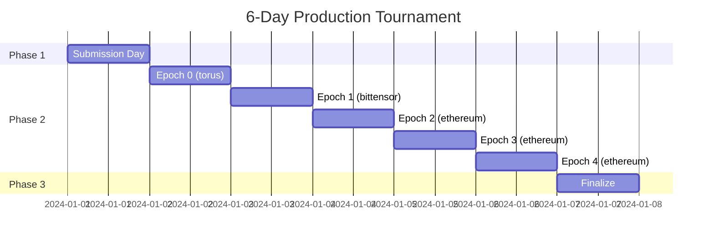
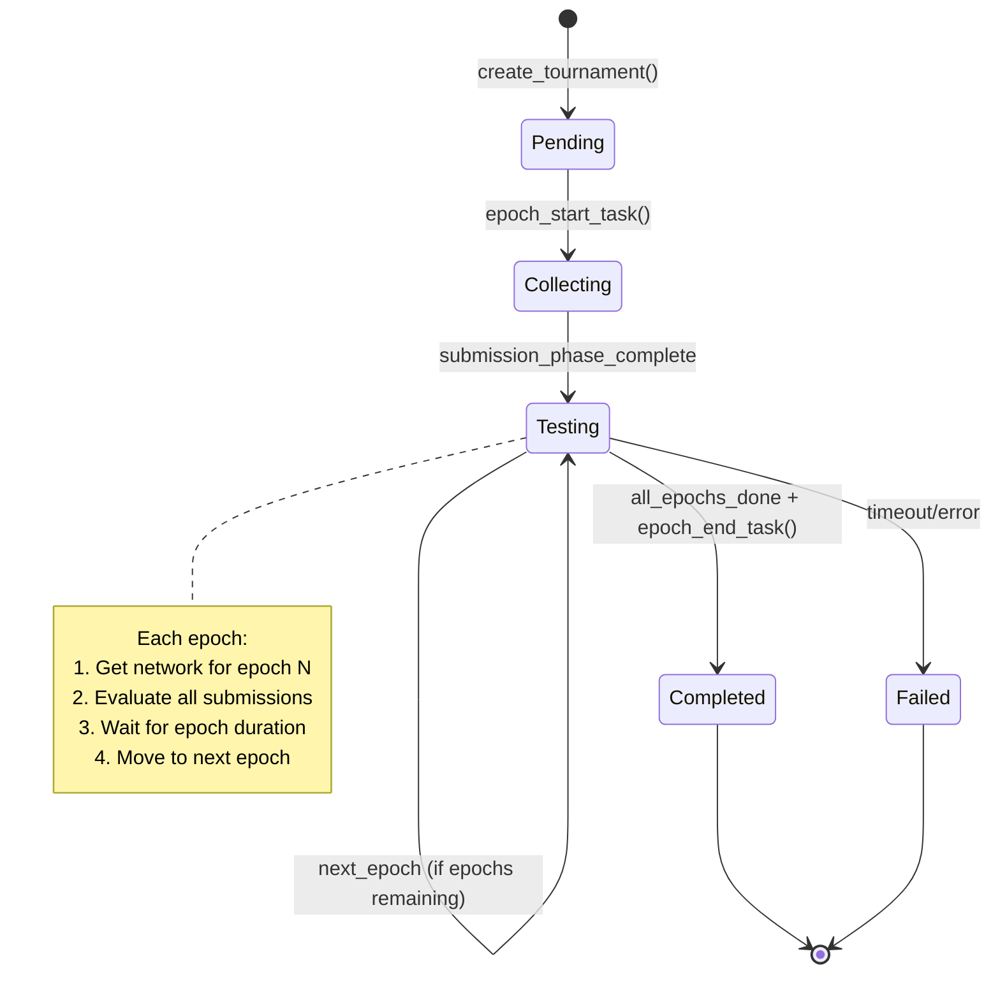
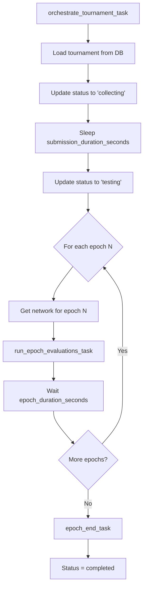
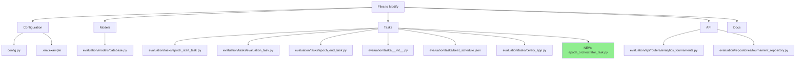

# Flexible Tournament Timing Configuration

**Status:** Approved  
**Date:** 2025-12-15  
**Author:** Architecture Mode  

## Table of Contents

1. [Overview](#overview)
2. [Problem Statement](#problem-statement)
3. [Solution Design](#solution-design)
4. [Architecture Changes](#architecture-changes)
5. [Implementation Plan](#implementation-plan)
6. [Configuration Examples](#configuration-examples)
7. [Migration Strategy](#migration-strategy)
8. [File Changes Summary](#file-changes-summary)

---

## Overview

This document outlines the design for flexible tournament timing configuration in the evaluation framework. The goal is to support rapid development cycles (10-minute tournaments) while maintaining production deployment capability (6-day tournaments) using the same codebase with different environment configurations.

### Key Features

- **Configurable timing** via environment variables
- **Two scheduling modes**: manual (development) and daily (production)
- **Flexible network assignment** per epoch with fallback logic
- **Backward compatible** - no database migrations required
- **Self-contained orchestration** - no external cron dependency

---

## Problem Statement

### Current System Limitations

The current evaluation system has hardcoded timing that's unsuitable for development:

1. **Hardcoded 5-day evaluation period** in [`epoch_start_task.py:87`](../../evaluation/tasks/epoch_start_task.py)
2. **Cron-based scheduling** in [`beat_schedule.json`](../../evaluation/tasks/beat_schedule.json) (daily at midnight UTC)
3. **No support for rapid iteration** - minimum cycle time is 5+ days
4. **Network assignment inflexibility** - all networks evaluated per day, not per epoch

### Current Flow

```
Day 0, 00:00 UTC → epoch_start_task (collect submissions)
Day 0-4, hourly  → evaluation_task (run all submissions across all networks)
Day 4, 23:00 UTC → epoch_end_task (calculate rankings, set weights)
```

**Problems:**
- Cannot test changes quickly during development
- Evaluation runs multi-network per day (complex and slow)
- Timing is inflexible and hardcoded

---

## Solution Design

### Core Concept

**Tournament Structure:**
1. **Submission Phase** - Miners submit their code repositories
2. **Testing Phase** - Sequential epochs (days), ONE network per epoch
3. **Finalization Phase** - Calculate rankings and set weights on-chain

### **CRITICAL: Evaluation Model**

**Each epoch (day) evaluates ALL miners on EXACTLY ONE network:**

- **Epoch 0 (Day 0)**: Miner A, Miner B, Miner C → **bitcoin network**
- **Epoch 1 (Day 1)**: Miner A, Miner B, Miner C → **zcash network**
- **Epoch 2 (Day 2)**: Miner A, Miner B, Miner C → **bittensor network**

**Each miner is evaluated ONCE per epoch (per day) on that epoch's assigned network.**

This is NOT multi-network per day - it's ONE network per day, ALL miners on that network.

### Tournament Timeline Comparison

#### Development (10 minutes)

```mermaid
gantt
    title 10-Minute Development Tournament
    dateFormat mm:ss
    axisFormat %M:%S
    
    section Phase 1: Submission
    Collect submissions from miners :00:00, 02:00
    
    section Phase 2: Testing
    Epoch 0 (network: torus) :02:00, 03:00
    Epoch 1 (network: torus) :05:00, 03:00
    Epoch 2 (network: torus) :08:00, 03:00
    
    section Phase 3: Finalize
    Calculate rankings & set weights :11:00, 01:00
```

**Configuration:**
- Submission duration: 2 minutes
- Epoch count: 3
- Epoch duration: 3 minutes each
- Networks: `["torus"]` (single network)
- **Total time:** ~12 minutes

#### Production (6 days)



**Configuration:**
- Submission duration: 24 hours (1 day)
- Epoch count: 5
- Epoch duration: 24 hours each
- Networks: `["torus", "bittensor", "ethereum"]`
- **Total time:** 6 days

### Network Assignment Logic

**CRITICAL:** Each epoch (day) has EXACTLY ONE network. All miners are evaluated on that single network for that epoch.

**This means:**
- Epoch 0: ALL miners tested on network[0]
- Epoch 1: ALL miners tested on network[1]
- Epoch 2: ALL miners tested on network[2]
- etc.

If there are more epochs than networks, the **last network repeats**.

```python
def get_network_for_epoch(epoch_number: int, networks: List[str]) -> str:
    """
    Map epoch number to network.
    If more epochs than networks, repeat the last network.
    
    Examples:
        networks = ["bitcoin", "zcash", "bittensor"]
        epoch 0 → bitcoin
        epoch 1 → zcash
        epoch 2 → bittensor
        epoch 3 → bittensor (repeat last)
        epoch 4 → bittensor (repeat last)
    """
    if epoch_number < len(networks):
        return networks[epoch_number]
    return networks[-1]  # Repeat last network
```

**Example Assignments:**

| Networks Config | Epochs | Day 0 | Day 1 | Day 2 | Day 3 | Day 4 |
|----------------|--------|-------|-------|-------|-------|-------|
| `["bitcoin", "zcash", "bittensor"]` | 5 | bitcoin | zcash | bittensor | bittensor | bittensor |
| `["torus"]` | 3 | torus | torus | torus | - | - |
| `["torus", "bittensor"]` | 5 | torus | bittensor | bittensor | bittensor | bittensor |

**What happens each day:**
- **Day 0**: ALL miners evaluated on bitcoin
- **Day 1**: ALL miners evaluated on zcash
- **Day 2**: ALL miners evaluated on bittensor
- **Day 3**: ALL miners evaluated on bittensor (repeat last)
- **Day 4**: ALL miners evaluated on bittensor (repeat last)

**Each miner submission is evaluated ONLY ONCE PER DAY on that day's network.**

---

## Architecture Changes

### State Machine



### Task Flow Architecture

```mermaid
sequenceDiagram
    participant API as Manual Trigger / Cron
    participant Start as epoch_start_task
    participant Orchestrator as epoch_orchestrator_task
    participant Eval as run_epoch_evaluations_task
    participant End as epoch_end_task
    participant DB as Database
    
    API->>Start: create_tournament(epoch_number)
    Start->>DB: Create tournament (status=pending)
    Start->>DB: Collect submissions via SubmissionSynapse
    Start->>Orchestrator: schedule_orchestrator(tournament_id)
    
    Note over Orchestrator: Wait submission_duration_seconds
    
    Orchestrator->>DB: Update status=testing
    loop For each epoch (0 to epoch_count-1)
        Orchestrator->>Eval: run_epoch(tournament_id, epoch_num)
        Eval->>DB: Get network for epoch
        Eval->>DB: Queue all submissions for this network
        Note over Eval: Evaluate all submissions (parallel)
        Eval-->>Orchestrator: Epoch complete
        Note over Orchestrator: Wait epoch_duration_seconds
    end
    
    Orchestrator->>End: epoch_end_task(tournament_id)
    End->>DB: Calculate rankings
    End->>DB: Set weights on-chain
    End->>DB: Update status=completed
```

### New Orchestrator Task

The orchestrator task replaces cron-based scheduling with internal task chaining:



**Responsibilities:**
1. Wait for submission duration
2. Loop through epochs sequentially
3. Trigger evaluation for each epoch
4. Wait between epochs
5. Trigger final ranking/weight setting

---

## Implementation Plan

### Phase 1: Configuration & Models

#### 1.1 Update Configuration ([`config.py`](../../config.py))

**Add tournament timing settings:**

```python
from typing import List

class Settings(BaseSettings):
    # ... existing fields ...
    
    # Tournament Timing Configuration
    tournament_submission_duration_seconds: int = 120
    tournament_epoch_count: int = 3
    tournament_epoch_duration_seconds: int = 180
    tournament_networks: str = "torus"
    tournament_schedule_mode: str = "manual"  # "manual" or "daily"
    
    @property
    def tournament_networks_list(self) -> List[str]:
        """Parse comma-separated networks into list"""
        return [n.strip() for n in self.tournament_networks.split(",")]
```

**Schedule Modes:**
- **`manual`**: For development, start tournaments via API anytime
- **`daily`**: For production, auto-start at 00:00 UTC via Celery Beat

#### 1.2 Update Tournament Model ([`evaluation/models/database.py`](../../evaluation/models/database.py))

**Add helper methods:**

```python
class AnalyticsTournament(Base):
    # ... existing fields ...
    
    def get_network_for_epoch(self, epoch_number: int) -> str:
        """
        Get network for specific epoch.
        If epoch > network count, use last network.
        """
        networks = self.test_networks
        if not networks:
            raise ValueError("No test networks configured")
        if epoch_number < len(networks):
            return networks[epoch_number]
        return networks[-1]
    
    @property
    def total_expected_runs(self) -> int:
        """Calculate total expected evaluation runs"""
        epoch_count = self.get_epoch_count()
        submission_count = self.total_submissions
        return epoch_count * submission_count
    
    def get_epoch_count(self) -> int:
        """Get epoch count with backward compatibility"""
        # New format
        if "epoch_count" in self.config:
            return self.config["epoch_count"]
        # Old format fallback
        if "evaluation_days" in self.config:
            return self.config["evaluation_days"]
        # Default
        return 5
```

---

### Phase 2: Task Refactoring

#### 2.1 Update Epoch Start Task ([`evaluation/tasks/epoch_start_task.py`](../../evaluation/tasks/epoch_start_task.py))

**Key changes:**

1. Remove hardcoded `evaluation_days: 5`
2. Use config values from settings
3. Schedule orchestrator task
4. Handle schedule mode

```python
@celery_app.task(name="evaluation.epoch_start")
def epoch_start_task(epoch_number: int = None) -> str:
    """
    Start tournament.
    
    Args:
        epoch_number: Optional. If None, auto-increment from last tournament.
    """
    session = get_session()
    repo = TournamentRepository(session)
    
    try:
        # Check if we should run based on schedule mode
        if config.tournament_schedule_mode == "manual":
            if epoch_number is None:
                logger.warning("manual_mode_requires_epoch_number")
                return None
        
        # Auto-increment epoch if not provided
        if epoch_number is None:
            last_tournament = repo.get_latest_tournament()
            epoch_number = (last_tournament.epoch_number + 1) if last_tournament else 1
        
        # Check if epoch already exists
        existing = repo.get_by_epoch(epoch_number)
        if existing:
            raise ValueError(f"epoch_already_exists: {epoch_number}")
        
        # Check for active tournament
        active = repo.get_active_tournament()
        if active:
            raise ValueError(f"active_tournament_exists: epoch {active.epoch_number}")
        
        now = datetime.utcnow()
        
        # Create tournament with config from settings
        tournament = AnalyticsTournament(
            id=uuid.uuid4(),
            epoch_number=epoch_number,
            status="pending",
            started_at=now,
            total_submissions=0,
            total_evaluation_runs=0,
            config={
                "submission_duration_seconds": config.tournament_submission_duration_seconds,
                "epoch_count": config.tournament_epoch_count,
                "epoch_duration_seconds": config.tournament_epoch_duration_seconds,
                "baseline_repository": "https://github.com/chainswarm/analyzers-baseline",
                "baseline_version": "0.1.3",
            },
            test_networks=config.tournament_networks_list,
            created_at=now,
        )
        tournament = repo.create_tournament(tournament)
        
        # Initialize Bittensor components
        wallet = bt.Wallet(name=config.wallet_name, hotkey=config.wallet_hotkey)
        subtensor = bt.Subtensor(network=config.subtensor_network)
        netuid = 1  # TODO: Get from config
        metagraph = subtensor.metagraph(netuid=netuid)
        dendrite = bt.Dendrite(wallet=wallet)
        
        # Collect submissions
        submissions_data = collect_submissions_from_miners(dendrite, metagraph, tournament)
        
        # Create submission records
        for sub_data in submissions_data:
            submission = AnalyticsTournamentSubmission(
                id=uuid.uuid4(),
                tournament_id=tournament.id,
                hotkey=sub_data["hotkey"],
                uid=sub_data["uid"],
                docker_image_digest="",
                repository_url=sub_data["repository_url"],
                status="pending",
                submitted_at=now,
            )
            repo.create_submission(submission)
        
        # Update tournament
        tournament.total_submissions = len(submissions_data)
        repo.update_status(tournament.id, "collecting")
        
        # Schedule orchestrator task
        from evaluation.tasks.epoch_orchestrator_task import orchestrate_tournament_task
        orchestrate_tournament_task.apply_async(
            args=[str(tournament.id)],
            countdown=5,  # Start after 5 seconds
        )
        
        logger.info(
            "epoch_started",
            tournament_id=str(tournament.id),
            epoch_number=epoch_number,
            submissions=len(submissions_data),
            test_networks=tournament.test_networks,
        )
        
        return str(tournament.id)
    
    finally:
        session.close()
```

#### 2.2 Create Orchestrator Task (NEW FILE)

**New file:** [`evaluation/tasks/epoch_orchestrator_task.py`](../../evaluation/tasks/epoch_orchestrator_task.py)

```python
import time
from uuid import UUID
from loguru import logger

from evaluation.db import get_session
from evaluation.repositories.tournament_repository import TournamentRepository
from evaluation.tasks.celery_app import celery_app


@celery_app.task(name="evaluation.orchestrate_tournament")
def orchestrate_tournament_task(tournament_id: str) -> dict:
    """
    Orchestrate the complete tournament lifecycle:
    1. Wait for submission duration
    2. For each epoch: trigger evaluations and wait
    3. Trigger final ranking and weight setting
    
    Args:
        tournament_id: UUID of the tournament to orchestrate
        
    Returns:
        Dict with execution summary
    """
    session = get_session()
    repo = TournamentRepository(session)
    
    try:
        tournament = repo.get_by_id(UUID(tournament_id))
        if not tournament:
            raise ValueError(f"tournament_not_found: {tournament_id}")
        
        # Get configuration
        submission_duration = tournament.config.get("submission_duration_seconds", 120)
        epoch_count = tournament.config.get("epoch_count", 3)
        epoch_duration = tournament.config.get("epoch_duration_seconds", 180)
        
        logger.info(
            "orchestrator_started",
            tournament_id=tournament_id,
            submission_duration=submission_duration,
            epoch_count=epoch_count,
            epoch_duration=epoch_duration,
        )
        
        # Phase 1: Wait for submission duration
        logger.info("waiting_for_submissions", duration=submission_duration)
        time.sleep(submission_duration)
        
        # Phase 2: Testing epochs
        repo.update_status(UUID(tournament_id), "testing")
        
        from evaluation.tasks.evaluation_task import run_epoch_evaluations_task
        
        for epoch_number in range(epoch_count):
            logger.info("starting_epoch", epoch=epoch_number, tournament_id=tournament_id)
            
            # Trigger evaluation for this epoch
            result = run_epoch_evaluations_task.apply_async(
                args=[tournament_id, epoch_number]
            ).get()  # Wait for completion
            
            logger.info(
                "epoch_completed",
                epoch=epoch_number,
                runs_queued=result.get("total_runs_queued", 0),
            )
            
            # Wait between epochs (except after last epoch)
            if epoch_number < epoch_count - 1:
                logger.info("waiting_between_epochs", duration=epoch_duration)
                time.sleep(epoch_duration)
        
        # Phase 3: Final ranking and weight setting
        logger.info("starting_finalization", tournament_id=tournament_id)
        
        from evaluation.tasks.epoch_end_task import epoch_end_task
        end_result = epoch_end_task.apply_async(
            args=[tournament_id]
        ).get()
        
        logger.info(
            "tournament_orchestration_complete",
            tournament_id=tournament_id,
            participants=end_result.get("participants", 0),
            winner=end_result.get("winner"),
        )
        
        return {
            "success": True,
            "tournament_id": tournament_id,
            "epochs_completed": epoch_count,
            "finalization_result": end_result,
        }
    
    except Exception as e:
        logger.error("orchestration_error", tournament_id=tournament_id, error=str(e))
        
        # Mark tournament as failed
        try:
            repo.update_status(UUID(tournament_id), "failed")
        except:
            pass
        
        return {
            "success": False,
            "tournament_id": tournament_id,
            "error": str(e),
        }
    
    finally:
        session.close()
```

#### 2.3 Refactor Evaluation Task ([`evaluation/tasks/evaluation_task.py`](../../evaluation/tasks/evaluation_task.py))

**Add new task for epoch-based evaluation:**

```python
@celery_app.task(name="evaluation.run_epoch")
def run_epoch_evaluations_task(
    tournament_id: str,
    epoch_number: int
) -> dict:
    """
    Queue evaluations for ALL submissions for a SINGLE epoch (day).
    
    CRITICAL: Each epoch uses EXACTLY ONE network.
    All miners are evaluated on that single network for this epoch.
    
    Example for epoch_number=0 with network="bitcoin":
        - Evaluate Miner A on bitcoin
        - Evaluate Miner B on bitcoin
        - Evaluate Miner C on bitcoin
    
    Example for epoch_number=1 with network="zcash":
        - Evaluate Miner A on zcash
        - Evaluate Miner B on zcash
        - Evaluate Miner C on zcash
    
    Each miner is evaluated ONCE per epoch on that epoch's network.
    
    Args:
        tournament_id: UUID of the tournament
        epoch_number: Epoch number (determines which network to use)
        
    Returns:
        Dict with total runs queued
    """
    session = get_session()
    repo = TournamentRepository(session)
    
    try:
        tournament = repo.get_by_id(UUID(tournament_id))
        if not tournament:
            raise ValueError(f"tournament_not_found: {tournament_id}")
        
        # CRITICAL: Get THE SINGLE network for this epoch
        # epoch 0 → bitcoin, epoch 1 → zcash, epoch 2 → bittensor, etc.
        network = tournament.get_network_for_epoch(epoch_number)
        
        # Get ALL validated submissions (all miners)
        submissions = repo.get_validated_submissions(UUID(tournament_id))
        
        # Calculate test date
        base_date = tournament.started_at.date()
        test_date = base_date + timedelta(days=epoch_number)
        
        queued = 0
        
        # Queue evaluation for EACH submission on this epoch's network
        # This evaluates ALL miners on THE SAME network for this epoch
        for submission in submissions:
            run_submission_task.delay(
                submission_id=str(submission.id),
                epoch_number=epoch_number,
                network=network,  # SAME network for all miners this epoch
                test_date=test_date.strftime("%Y-%m-%d"),
            )
            queued += 1
        
        logger.info(
            "epoch_evaluation_queued",
            tournament_id=tournament_id,
            epoch_number=epoch_number,
            network=network,
            submissions=len(submissions),
            total_runs=queued,
            message=f"Evaluating {len(submissions)} miners on {network} network"
        )
        
        return {
            "total_runs_queued": queued,
            "epoch_number": epoch_number,
            "network": network,
            "submissions": len(submissions),
        }
    
    finally:
        session.close()
```

**Note:** Keep the existing `run_submission_task` unchanged - it still handles individual submission evaluation.

#### 2.4 Update Epoch End Task ([`evaluation/tasks/epoch_end_task.py`](../../evaluation/tasks/epoch_end_task.py))

**Update expected runs calculation:**

```python
def calculate_final_rankings(
    repo: TournamentRepository,
    tournament_id: UUID,
) -> List[Tuple[str, int, int, float, Dict]]:
    """
    Calculate rankings with STRICT multi-day disqualification.
    """
    tournament = repo.get_by_id(tournament_id)
    runs = repo.get_runs_by_tournament(tournament_id)
    
    # Calculate expected runs per submission
    # NEW: epoch_count × 1 network per epoch
    epoch_count = tournament.get_epoch_count()
    expected_runs_per_submission = epoch_count
    
    # Rest of logic remains the same...
    # Group by submission, check for failures, aggregate scores, etc.
```

#### 2.5 Update Task Registry ([`evaluation/tasks/__init__.py`](../../evaluation/tasks/__init__.py))

```python
from evaluation.tasks.celery_app import celery_app
from evaluation.tasks.epoch_end_task import epoch_end_task
from evaluation.tasks.epoch_start_task import epoch_start_task
from evaluation.tasks.epoch_orchestrator_task import orchestrate_tournament_task
from evaluation.tasks.evaluation_task import (
    run_all_submissions_task,  # Keep for backward compat
    run_submission_task,
    run_epoch_evaluations_task,  # NEW
)

__all__ = [
    "celery_app",
    "epoch_end_task",
    "epoch_start_task",
    "orchestrate_tournament_task",  # NEW
    "run_all_submissions_task",
    "run_submission_task",
    "run_epoch_evaluations_task",  # NEW
]
```

---

### Phase 3: Scheduling Configuration

#### 3.1 Update Celery Beat Schedule ([`evaluation/tasks/beat_schedule.json`](../../evaluation/tasks/beat_schedule.json))

**Simplified for daily scheduling only:**

```json
{
    "epoch-start-daily": {
        "task": "evaluation.epoch_start",
        "schedule": "0 0 * * *",
        "args": []
    }
}
```

**Important:** The `epoch_start_task` will check `config.tournament_schedule_mode` and only proceed if set to `"daily"`.

#### 3.2 Update Celery App Configuration ([`evaluation/tasks/celery_app.py`](../../evaluation/tasks/celery_app.py))

**Ensure beat schedule is loaded:**

```python
from celery import Celery
from celery.schedules import crontab
import json
from pathlib import Path

from config import config

celery_app = Celery(
    "subnet2_evaluation",
    broker=config.redis_url,
    backend=config.redis_url,
)

celery_app.conf.update(
    task_serializer="json",
    accept_content=["json"],
    result_serializer="json",
    timezone="UTC",
    enable_utc=True,
    task_track_started=True,
    task_time_limit=3600,
    task_soft_time_limit=3500,
)

# Load beat schedule from JSON if in daily mode
if config.tournament_schedule_mode == "daily":
    beat_schedule_path = Path(__file__).parent / "beat_schedule.json"
    if beat_schedule_path.exists():
        with open(beat_schedule_path) as f:
            schedule_config = json.load(f)
            
        # Convert cron strings to crontab objects
        beat_schedule = {}
        for name, task_config in schedule_config.items():
            cron_parts = task_config["schedule"].split()
            beat_schedule[name] = {
                "task": task_config["task"],
                "schedule": crontab(
                    minute=cron_parts[0],
                    hour=cron_parts[1],
                    day_of_month=cron_parts[2],
                    month_of_year=cron_parts[3],
                    day_of_week=cron_parts[4],
                ),
                "args": task_config.get("args", []),
            }
        
        celery_app.conf.beat_schedule = beat_schedule

celery_app.autodiscover_tasks([
    "evaluation.tasks",
])
```

---

### Phase 4: API Endpoints

#### 4.1 Add Manual Tournament Trigger ([`evaluation/api/routers/analytics_tournaments.py`](../../evaluation/api/routers/analytics_tournaments.py))

**Add endpoint:**

```python
@router.post(
    "/start",
    summary="Start New Tournament",
    description="""
Start a new tournament manually with current configuration.

**Note:** In production with `TOURNAMENT_SCHEDULE_MODE=daily`, 
tournaments auto-start at 00:00 UTC via Celery Beat.

This endpoint is primarily for development with `TOURNAMENT_SCHEDULE_MODE=manual`.
    """,
    response_model=dict,
)
async def start_tournament(
    epoch_number: int = Query(..., description="Epoch number for this tournament", ge=1),
    db: Session = Depends(get_db),
):
    """Manually trigger a new tournament"""
    from evaluation.tasks.epoch_start_task import epoch_start_task
    
    # Check for active tournament
    active = db.query(AnalyticsTournament).filter(
        AnalyticsTournament.status.in_([
            "pending",
            "collecting",
            "testing",
            "evaluating"
        ])
    ).first()
    
    if active:
        raise HTTPException(
            status_code=409,
            detail=f"Active tournament exists: epoch {active.epoch_number}, status={active.status}"
        )
    
    # Check if epoch already exists
    existing = db.query(AnalyticsTournament).filter(
        AnalyticsTournament.epoch_number == epoch_number
    ).first()
    
    if existing:
        raise HTTPException(
            status_code=409,
            detail=f"Tournament for epoch {epoch_number} already exists"
        )
    
    # Trigger task
    task = epoch_start_task.delay(epoch_number)
    
    return {
        "task_id": task.id,
        "epoch_number": epoch_number,
        "message": "Tournament starting",
        "status": "queued"
    }
```

---

### Phase 5: Repository Updates

#### 5.1 Add Latest Tournament Query ([`evaluation/repositories/tournament_repository.py`](../../evaluation/repositories/tournament_repository.py))

```python
def get_latest_tournament(self) -> Optional[AnalyticsTournament]:
    """Get most recent tournament by epoch number"""
    return self.session.query(AnalyticsTournament)\
        .order_by(AnalyticsTournament.epoch_number.desc())\
        .first()
```

---

### Phase 6: Documentation

#### 6.1 Update .env.example ([`.env.example`](../../.env.example))

**Add tournament configuration section:**

```bash
# Tournament Configuration
# ========================

# Timing Configuration
TOURNAMENT_SUBMISSION_DURATION_SECONDS=120
TOURNAMENT_EPOCH_COUNT=3
TOURNAMENT_EPOCH_DURATION_SECONDS=180
TOURNAMENT_NETWORKS=torus

# Schedule Mode: "manual" or "daily"
# - manual: Start tournaments via API (development)
# - daily: Auto-start at 00:00 UTC via Celery Beat (production)
TOURNAMENT_SCHEDULE_MODE=manual

# Production Example:
# TOURNAMENT_SUBMISSION_DURATION_SECONDS=86400
# TOURNAMENT_EPOCH_COUNT=5
# TOURNAMENT_EPOCH_DURATION_SECONDS=86400
# TOURNAMENT_NETWORKS=torus,bittensor,ethereum
# TOURNAMENT_SCHEDULE_MODE=daily
```

---

## Configuration Examples

### Development Configuration

**Purpose:** Rapid iteration and testing during development

**.env:**
```bash
# Development: 10-minute tournaments
TOURNAMENT_SCHEDULE_MODE=manual
TOURNAMENT_SUBMISSION_DURATION_SECONDS=120      # 2 minutes
TOURNAMENT_EPOCH_COUNT=3                         # 3 epochs
TOURNAMENT_EPOCH_DURATION_SECONDS=180           # 3 minutes each
TOURNAMENT_NETWORKS=torus                        # Single network
```

**Timeline:**
- 00:00 - 02:00: Submission phase (collect from miners)
- 02:00 - 05:00: Epoch 0 - ALL miners evaluated on **torus** network
- 05:00 - 08:00: Epoch 1 - ALL miners evaluated on **torus** network
- 08:00 - 11:00: Epoch 2 - ALL miners evaluated on **torus** network
- 11:00 - 12:00: Finalization (rankings + weights)
- **Total:** ~12 minutes

**Evaluations:**
- Each miner evaluated 3 times total (once per epoch)
- All epochs use same network (torus) since only 1 network configured

**Usage:**
```bash
# Start tournament manually via API
curl -X POST "http://localhost:8000/api/v1/tournaments/start?epoch_number=1"
```

---

### Production Configuration

**Purpose:** Live network deployment with on-chain weight setting

**.env:**
```bash
# Production: 6-day tournaments
TOURNAMENT_SCHEDULE_MODE=daily
TOURNAMENT_SUBMISSION_DURATION_SECONDS=86400    # 24 hours (1 day)
TOURNAMENT_EPOCH_COUNT=5                         # 5 epochs
TOURNAMENT_EPOCH_DURATION_SECONDS=86400         # 24 hours each
TOURNAMENT_NETWORKS=torus,bittensor,ethereum    # Multiple networks
```

**Timeline:**
- Day 1 (00:00 - 23:59): Submission phase (collect from miners)
- Day 2 (00:00 - 23:59): Epoch 0 - ALL miners evaluated on **torus** network
- Day 3 (00:00 - 23:59): Epoch 1 - ALL miners evaluated on **bittensor** network
- Day 4 (00:00 - 23:59): Epoch 2 - ALL miners evaluated on **ethereum** network
- Day 5 (00:00 - 23:59): Epoch 3 - ALL miners evaluated on **ethereum** network (repeat)
- Day 6 (00:00 - 23:59): Epoch 4 - ALL miners evaluated on **ethereum** network (repeat)
- Day 7: Finalization (rankings + weights)
- **Total:** 6-7 days

**Evaluations:**
- Each miner evaluated 5 times total (once per epoch/day)
- Day 2: All miners on torus
- Day 3: All miners on bittensor
- Days 4-6: All miners on ethereum (network list exhausted, repeat last)

**Scheduling:**
- Auto-starts at 00:00 UTC daily via Celery Beat
- Epoch number auto-increments from previous tournament

---

## Migration Strategy

### Database Migrations

**Status:** ✅ **NO MIGRATIONS REQUIRED**

**Reason:**
The existing database schema already supports all necessary fields:

```python
# From alembic/versions/001_initial_migration.py
sa.Column('config', postgresql.JSON(), nullable=False),
sa.Column('test_networks', postgresql.ARRAY(sa.String()), nullable=False),
```

**Backward Compatibility:**

Old tournaments use:
```json
{
  "evaluation_days": 5,
  "baseline_repository": "...",
  "baseline_version": "..."
}
```

New tournaments use:
```json
{
  "submission_duration_seconds": 120,
  "epoch_count": 3,
  "epoch_duration_seconds": 180,
  "baseline_repository": "...",
  "baseline_version": "..."
}
```

The code handles both formats via fallback logic:

```python
def get_epoch_count(self) -> int:
    """Get epoch count with backward compatibility"""
    if "epoch_count" in self.config:
        return self.config["epoch_count"]
    if "evaluation_days" in self.config:
        return self.config["evaluation_days"]
    return 5
```

---

## File Changes Summary

### Files to Modify (11 files)



### Detailed Changes

| File | Type | Description |
|------|------|-------------|
| [`config.py`](../../config.py) | Modified | Add tournament timing settings and schedule mode |
| [`evaluation/models/database.py`](../../evaluation/models/database.py) | Modified | Add helper methods for network assignment and epoch count |
| [`evaluation/tasks/epoch_start_task.py`](../../evaluation/tasks/epoch_start_task.py) | Modified | Use config values, schedule orchestrator, handle modes |
| [`evaluation/tasks/epoch_orchestrator_task.py`](../../evaluation/tasks/epoch_orchestrator_task.py) | **Created** | **NEW** orchestrator for tournament lifecycle |
| [`evaluation/tasks/evaluation_task.py`](../../evaluation/tasks/evaluation_task.py) | Modified | Add `run_epoch_evaluations_task` for single-epoch eval |
| [`evaluation/tasks/epoch_end_task.py`](../../evaluation/tasks/epoch_end_task.py) | Modified | Update expected runs calculation |
| [`evaluation/tasks/__init__.py`](../../evaluation/tasks/__init__.py) | Modified | Export new tasks |
| [`evaluation/tasks/beat_schedule.json`](../../evaluation/tasks/beat_schedule.json) | Modified | Simplify to daily only |
| [`evaluation/tasks/celery_app.py`](../../evaluation/tasks/celery_app.py) | Modified | Load beat schedule conditionally based on mode |
| [`evaluation/api/routers/analytics_tournaments.py`](../../evaluation/api/routers/analytics_tournaments.py) | Modified | Add `/start` endpoint for manual triggering |
| [`evaluation/repositories/tournament_repository.py`](../../evaluation/repositories/tournament_repository.py) | Modified | Add `get_latest_tournament()` method |
| [`.env.example`](../../.env.example) | Modified | Document tournament configuration |

---

## Testing Strategy

### Development Testing

1. **Set development config** in `.env`
2. **Start Celery worker and beat**:
   ```bash
   celery -A evaluation.tasks.celery_app worker --loglevel=info
   ```
3. **Trigger tournament via API**:
   ```bash
   curl -X POST "http://localhost:8000/api/v1/tournaments/start?epoch_number=1"
   ```
4. **Monitor logs** for orchestration flow
5. **Verify timing**: Should complete in ~12 minutes

### Production Testing (Staging)

1. **Set production config** in `.env`
2. **Start Celery Beat**:
   ```bash
   celery -A evaluation.tasks.celery_app beat --loglevel=info
   celery -A evaluation.tasks.celery_app worker --loglevel=info
   ```
3. **Wait for 00:00 UTC** or manually trigger
4. **Monitor tournament** through 6-day cycle
5. **Verify on-chain weights** are set correctly

---

## Benefits

### Development Benefits

✅ **10-minute tournaments** instead of 6 days  
✅ **Rapid iteration** on evaluation logic  
✅ **Single network testing** reduces complexity  
✅ **Manual control** via API  
✅ **Same codebase** as production  

### Production Benefits

✅ **Consistent scheduling** at 00:00 UTC  
✅ **Configurable epochs** (can adjust from 5 if needed)  
✅ **Flexible network assignment** with fallback  
✅ **Self-contained orchestration** (no external cron)  
✅ **Backward compatible** with existing tournaments  

### Code Quality Benefits

✅ **Environment-driven** configuration  
✅ **No database migrations** required  
✅ **Clean separation** between scheduling and evaluation  
✅ **Testable** orchestration logic  
✅ **Maintainable** task structure  

---

## Next Steps

1. Review and approve this architectural plan
2. Implement changes in code mode
3. Test in development environment
4. Deploy to staging for extended testing
5. Roll out to production

---

## Questions & Answers

**Q: Will this break existing tournaments?**  
A: No, backward compatibility is built in. Old tournaments continue to work with `evaluation_days`, new tournaments use `epoch_count`.

**Q: Can I switch between manual and daily mode?**  
A: Yes, just change `TOURNAMENT_SCHEDULE_MODE` in `.env` and restart Celery.

**Q: What if I need different timing for different tournaments?**  
A: Currently timing is environment-wide. For per-tournament timing, we'd need to add tournament creation parameters (future enhancement).

**Q: How do I stop a running tournament?**  
A: The orchestrator task can be terminated via Celery, and tournament status can be manually updated in the database. A proper cancel endpoint could be added as a future enhancement.

**Q: Does this work with multiple validators?**  
A: Yes, but ensure only one validator has `TOURNAMENT_SCHEDULE_MODE=daily` to avoid duplicate tournaments. For manual mode, coordinate tournament start times.

---

## References

- [Evaluation Framework Architecture](./EVALUATION_FRAMEWORK_ARCHITECTURE.md)
- [Evaluation Scoring Model](./EVALUATION_SCORING_MODEL.md)
- [Celery Documentation](https://docs.celeryproject.org/)
- [Bittensor Documentation](https://docs.bittensor.com/)
